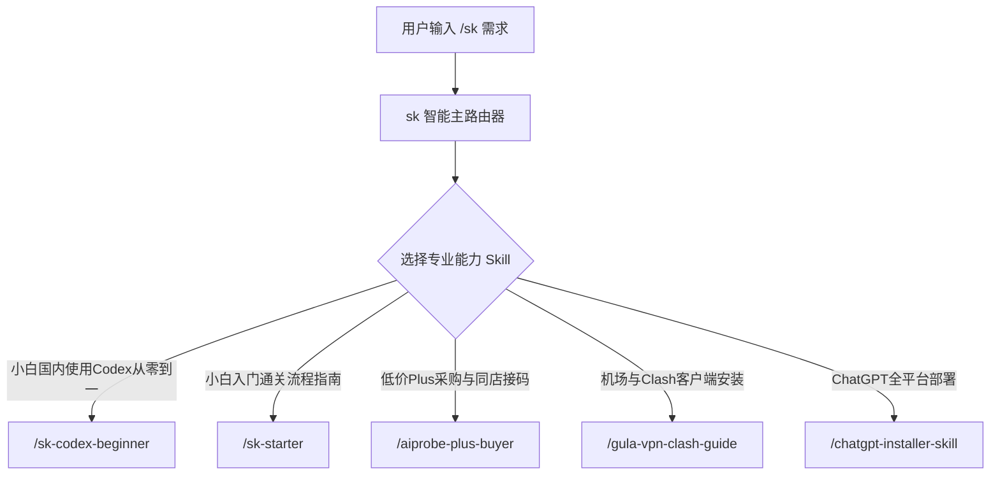

# SkillDB System — 面向“想学习 AI 变现人群”的开源 AI Skills 通关工具箱

[简体中文](README.md) | [English](README.md)

支持 Agent 平台：**Antigravity / Claude Code / Codex / WorkBuddy / Trae / 豆包** 等所有支持 Skill 规范的 Agent。

---

## 🎯 系统核心定位：聚焦“AI 变现”全生命周期

本 Skill 系统专为**想要学习 AI 变现的人群**（独立开发者、AI 副业创作者、自媒体引流者、Solo Founder）打造，帮助用户从 **0 到 1 破除基建门槛**（网络代理、软件安装、账号采购与接码验证），顺利开启 AI 变现之路。



---

## ⚡️ 快速开始

在 Agent 终端或聊天框中直接使用：

### 1. 智能路由唤醒 (`/sk`)
```text
/sk 我是国内小白，想从零开始配置 ChatGPT 和使用 Codex 编程，怎么操作？
```

### 2. 显式调用具体技能
```text
/sk-codex-beginner       国内小白使用 Codex 的全流程通关指南
/sk-starter              新手入门 3 步通关基础教程
/aiprobe-plus-buyer      抓取 aiprobe.top 纯净低价 Plus 账号与 Codex 1元短信接码卡密
/gula-vpn-clash-guide    访问古拉防丢失发布站与全平台 Clash 配置指导
/chatgpt-installer-skill 安装 Windows / macOS ChatGPT 桌面版客户端
```

---

## 🧩 核心技能目录 (Core Skills Catalog)

| 技能标识 (Skill ID) | 推荐指令 | 核心功能与避坑细节说明 |
| :--- | :--- | :--- |
| **`sk-router`** | `/sk` | **主分发路由器**：智能识别用户意图并自动匹配调度最优 Skill。 |
| **`sk-codex-beginner`** | `/sk-codex-beginner` | **国内小白 Codex 从零到一通关指南**：说明网络解锁、Windows 区域改美国、以及在同一卡密平台购买 Codex 1元接码服务全流程。 |
| **`sk-starter`** | `/sk-starter` | **新手 3 步通关指南**：从 0 到 1 引导网络代理配置、客户端部署与账号采购。 |
| **`aiprobe-plus-buyer`** | `/aiprobe-plus-buyer` | **ChatGPT Plus / Codex 采购与同店接码**：实时抓取 `aiprobe.top` 数据，自动过滤 `提链/提炼/扫码/free/普号/icloud`，支持直接买账号与同一店铺买接码服务。 |
| **`gula-vpn-clash-guide`**| `/gula-vpn-clash-guide` | **古拉 VPN 与 Clash 配置指南**：说明 `古拉.com` 作为**防丢失导航发布主站**的机制（需手动在浏览器点开获取二级入口），并提供 4 步完整配置指导。 |
| **`chatgpt-installer-skill`**| `/chatgpt-installer-skill` | **ChatGPT 桌面版跨平台安装**：解决 Windows 微软商店“在所在地区不可用”问题（修改区域为美国 + Winget `9NT1R1C2HH7J` / `.msixbundle` 离线包）。 |

---

## 📖 新手教程关键细节摘录

### 1. 网络配置细节 (古拉防丢失主站 + 4 步法)
- **主站性质**：`https://古拉.com/` (`xn--w4r430a.com`) 为防丢失导航发布站，主站不直接提供节点，而是**指向最新二级入口**。必须由用户在浏览器手动打开点开跳转！
- **4 步配置**：手动打开获取二级入口 -> 注册邮箱并选择套餐（**强烈建议按月订阅**） -> 下载 Clash Verge Rev 软件并导入订阅 -> 切换 **规则模式 (Rule)** 并开启 **系统代理 (System Proxy)**。

### 2. Windows 客户端安装突破限制细节
- **修改系统区域**：按 **Win + I** 打开设置 -> **时间及语言** -> **区域** -> 将国家修改为 **美国 (United States)**（即时生效，解决商店搜不到或不可用）。
- **管理员 PowerShell 安装**：运行 `winget install --id=9NT1R1C2HH7J -e`。

### 3. 买号与 Codex 短信接码细节
- **过滤排除规则**：系统自动剔除 `提链`、`提炼`、`扫码`、`二维码`、`free`、`免费`、`普号`、`icloud`、`非Plus` 等干扰项。
- **同一平台同一店铺接码**：小白无需注册国外接码网站，在 `https://aiprobe.top/` 同一个店铺（如 *一梦AI*、*ai小头*、*奥特曼严选* 等）即可像买卡密一样直接购买 Codex 短信接码服务（单次约 1 元左右）。

---

## 🧠 结构化知识库系统 (`知识库/`)

本系统内嵌了结构化知识原子库，用于 RAG 检索与底层推理：
- **原子库 (`知识库/原子库/atoms.jsonl`)**: JSONL 格式的模块化知识点，方便导入 Qdrant / Ollama 向量库。
- **说明文档 (`知识库/README.md`)**: 介绍知识库架构与向量检索使用方法。

---

## 🛠️ 构建与维护工具链 (`tools/`)

开发或新增 Skill 后，使用项目内置工具链进行校验与自动化打包：

```bash
cd tools/

# 1. 运行 Linter 检查所有 Skill 的规范与 YAML 前置定义
python validate_skills.py

# 2. 打包生成发布目录 dist/skills/
python build_skills.py

# 3. 桥接同步至系统全局 Agent 目录 (~/.agents/skills)
python bridge_sync.py
```

---

## 📂 项目结构

```
skilldb/
├── skills/                     # 核心 Skill 库 (各技能包含 SKILL.md 与脚本)
│   ├── sk-router/              # 智能分发路由器
│   ├── sk-diagnosis/           # 商业诊断技能
│   ├── sk-content/             # 内容策划技能
│   ├── sk-benchmark/           # 竞品拆解技能
│   ├── sk-decision/            # 战略决策技能
│   ├── sk-knowledge/           # 知识库管理技能
│   ├── sk-bridge/              # 跨 Agent 桥接技能
│   ├── aiprobe-plus-buyer/     # 低价 Plus 会员与接码技能
│   ├── gula-vpn-clash-guide/   # 机场与 Clash 全指南技能
│   └── chatgpt-installer-skill/# ChatGPT 全平台安装技能
├── 知识库/                     # 结构化知识原子库与方法论
│   ├── 原子库/                 # atoms.jsonl 知识原子数据
│   └── README.md
├── docs/                       # 新手入门与全目录文档
│   └── 新手入门.md
├── tools/                      # 构建、校验与同步工具链
│   ├── validate_skills.py      # SKILL.md 规范校验器
│   ├── build_skills.py         # 自动打包构建脚本
│   └── bridge_sync.py          # 跨 Agent 同步桥接工具
├── .claude-plugin/             # Claude Code 插件市场配置
│   └── marketplace.json
├── VERSION                     # 版本号
├── LICENSE                     # CC BY-NC 4.0 许可证
└── README.md                   # 仓库主说明文档
```

---

## 📄 许可证

本项目采用 [CC BY-NC 4.0](LICENSE) 许可证。个人使用、学习研究与非商业项目均可自由免费使用。
