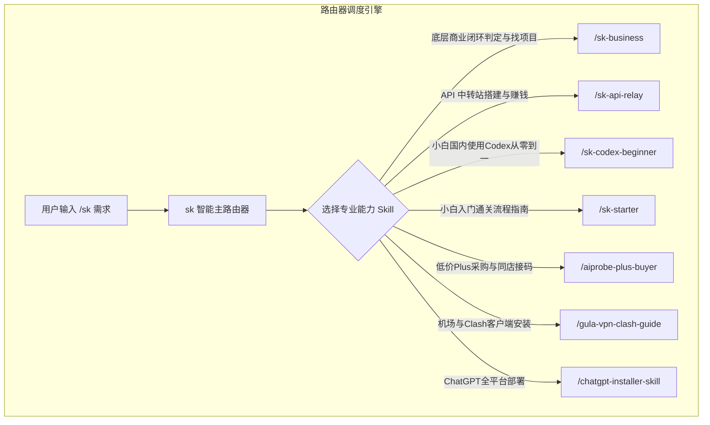

# SkillDB System — 面向“想学习 AI 变现人群”的开源 AI Skills 通关工具箱

[简体中文](README.md) | [English](README.md)

推荐：**Claude Code、豆包、WorkBuddy、Codex、Antigravity 与其他支持 Skills 的 Agent**

在终端执行：
```bash
npx -y skills add ss22219/skilldb -g --all
```
安装后回到 Agent，输入 `/sk` 即可开始。

---

## 📦 Claude Code 插件市场

也可以通过 Claude Code 插件市场安装完整工具箱：
```bash
claude plugin marketplace add ss22219/skilldb
claude plugin install skilldb@ss22219-skills
```

---

## 🔄 更新

已安装 `skilldb` 时，直接对当前 Agent 说：
> **更新 skilldb**

它会自动同步官方 `skilldb`，不会修改你在本地的存档、报告与决策记录。版本变化见 [GitHub Releases](https://github.com/ss22219/skilldb/releases)。

---

## ⚙️ skilldb 怎样工作

`sk` 是 Skill System 的总指挥与调度路由器。用户无需记忆具体的 Skill 名称，只需在命令前加 `/sk`，系统会自动调度最契合的通关 Skill。底层采用 **【流量 ➔ 转化 ➔ 交付】** 商业闭环引擎作为核心判决依据。



---

## ⚡️ 快速开始

在 Agent 终端或聊天框中直接使用：

### 1. 智能路由唤醒 (`/sk`)
```text
/sk 怎么判断一个 AI 项目能不能赚钱？怎么在自媒体上找对标像素级模仿？
```

### 2. 显式调用具体技能
```text
/sk-business             底层商业闭环判定与自媒体 4 步寻找/复刻对标项目指南
/sk-api-relay            大模型 API 中转站搭建与商业变现指南 (Sub2API/New-API/套利/自动发卡)
/sk-codex-beginner       国内小白使用 Codex 的全流程通关指南
/sk-starter              新手入门 3 步通关基础教程
/aiprobe-plus-buyer      抓取 aiprobe.top 纯净低价 Plus 账号与 Codex 1元短信接码卡密
/gula-vpn-clash-guide    访问古拉防丢失发布站与全平台 Clash 配置指导
/chatgpt-installer-skill 安装 Windows / macOS ChatGPT 桌面版客户端
```

---

## 🧩 核心技能目录 (Core Skills Catalog)

| 技能标识 (Skill ID) | 推荐指令 | 核心功能与避坑细节说明 |
| :--- | :--- | :--- |
| **`sk-router`** | `/sk` | **主分发路由器**：智能识别用户意图并自动匹配调度最优 Skill。 |
| **`sk-monetization-framework`** | `/sk-business` | **底层商业闭环判定引擎**：定义【流量 ➔ 转化 ➔ 交付】商业闭环三要素、判定项目能否赚钱的标准，提供自媒体 4 步寻找与像素级模仿复刻对标项目的实操方法论。 |
| **`sk-api-relay-monetization`** | `/sk-api-relay` | **大模型 API 中转站赚钱**：开源物理项目 `Sub2API` (`sub2api/sub2api`) / `New-API` (`calciumion/new-api`) 部署演进、海外 VPS 免备案购买、AI 驱动自动部署、联动小铺/发卡网 CDK 售卖、全套运维成本评估与 10% 薄利跑量/高毛利定价模型。 |
| **`sk-codex-beginner`** | `/sk-codex-beginner` | **国内小白 Codex 从零到一通关指南**：说明网络解锁、Windows 区域改美国、以及在同一卡密平台购买 Codex 1元接码服务全流程。 |
| **`sk-starter`** | `/sk-starter` | **新手 3 步通关指南**：从 0 到 1 引导网络代理配置、客户端部署与账号采购。 |
| **`aiprobe-plus-buyer`** | `/aiprobe-plus-buyer` | **ChatGPT Plus / Codex 采购与同店接码**：实时抓取 `aiprobe.top` 数据，自动过滤 `提链/提炼/扫码/free/普号/icloud`，支持直接买账号与同一店铺买接码服务。 |
| **`gula-vpn-clash-guide`**| `/gula-vpn-clash-guide` | **古拉 VPN 与 Clash 配置指南**：说明 `古拉.com` 作为**防丢失导航发布主站**的机制（需手动在浏览器点开获取二级入口），并提供 4 步完整配置指导。 |
| **`chatgpt-installer-skill`**| `/chatgpt-installer-skill` | **ChatGPT 桌面版跨平台安装**：解决 Windows 微软商店“在所在地区不可用”问题（修改区域为美国 + Winget `9NT1R1C2HH7J` / `.msixbundle` 离线包）。 |

---

## 📖 新手教程关键细节摘录

### 1. 底层商业闭环与自媒体 4 步寻找法
- **商业闭环判决**：任何 AI 变现项目必须具备【流量 ➔ 转化 ➔ 交付】全链路才算合格，三者缺一不可。
- **自媒体 4 步模仿**：`(a) 搜索对标` (利用搜索工具找热点) ➔ `(b) 筛选验证` (确认同行持续盈利) ➔ `(c) 拆解全链路` (剖析流量/转化/交付) ➔ `(d) 像素级模仿` (100% 复制已验证路径快速拿到商业结果)。

### 2. API 中转站商业变现与真实物理项目
- **物理真实项目避坑**：使用物理真实存在的 `sub2api/sub2api`（订阅号池转 API）、`calciumion/new-api`（大模型聚合网关）与 `cli-proxy-api`，摒弃与 AI 无关的电商插件。
- **流量与转化**：开源 Skill 工具箱教程自媒体引流，直播免费帮装软件配环境现场转化（80%+ 高转化），向客户突出“价格低、稳定性高、随时充值不过期、免国外卡与接码+一对一技术支持”4 大卖点。
- **架构与部署演进**：新手初级阶段单节点部署 `Sub2API` 挂载 Plus 订阅号池；业务扩容阶段多节点部署并由 `New-API` 统一路由网关聚合做负载均衡。
- **海外 VPS 与 AI 部署**：选择 RackNerd / Cloudcone / Vultr 等海外免备案 VPS（1核1-2G 轻量主机），直接通过 AI Agent（Claude Code/Antigravity）自动化部署 Docker、Caddy SSL 证书与容器。
- **CDK 发卡收单与成本评估**：上架联动小铺/发卡网卖 CDK 兑换码；定价前先通过 `总成本 = VPS月费 + 域名 + Plus账号采购 + 住宅IP代理` 算准保本单价，自由选择 **10% 薄利跑大流水模式** 或 **高毛利模式**。

### 3. 网络配置细节 (古拉防丢失主站 + 4 步法)
- **主站性质**：`https://古拉.com/` (`xn--w4r430a.com`) 为防丢失导航发布站，主站不直接提供节点，而是**指向最新二级入口**。必须由用户在浏览器手动打开点开跳转！
- **4 步配置**：手动打开获取二级入口 -> 注册邮箱并选择套餐（**强烈建议按月订阅**） -> 下载 Clash Verge Rev 软件并导入订阅 -> 切换 **规则模式 (Rule)** 并开启 **系统代理 (System Proxy)**。

### 4. Windows 客户端安装突破限制细节
- **修改系统区域**：按 **Win + I** 打开设置 -> **时间及语言** -> **区域** -> 将国家修改为 **美国 (United States)**（即时生效，解决商店搜不到或不可用）。
- **管理员 PowerShell 安装**：运行 `winget install --id=9NT1R1C2HH7J -e`。

### 5. 买号与 Codex 短信接码细节
- **过滤排除规则**：系统自动剔除 `提链`、`提炼`、`扫码`、`二维码`、`free`、`免费`、`普号`、`icloud`、`非Plus` 等干扰项。
- **同一平台同一店铺接码**：小白无需注册国外接码网站，在 `https://aiprobe.top/` 同一个店铺（如 *一梦AI*、*ai小头*、*奥特曼严选* 等）即可像买卡密一样直接购买 Codex 短信接码服务（单次约 1 元左右）。

---

## 🛠️ 构建与维护工具链 (`tools/`)

开发或新增 Skill 后，使用项目内置工具链进行校验：

```bash
cd tools/

# 运行 Linter 检查所有 Skill 的规范与 YAML 前置定义
python validate_skills.py
```

---

## 📂 项目结构

```
skilldb/
├── skills/                     # 核心 8 大实战 Skill 库
│   ├── sk-router/              # 智能分发路由器 (/sk)
│   ├── sk-monetization-framework/# 底层商业闭环判定与找项目框架 (/sk-business)
│   ├── sk-api-relay-monetization/# 大模型 API 中转站赚钱指南 (/sk-api-relay)
│   ├── sk-codex-beginner/      # 国内小白 Codex 0到1通关指南 (/sk-codex-beginner)
│   ├── sk-starter/             # 新手 3 步入门指南 (/sk-starter)
│   ├── aiprobe-plus-buyer/     # 低价 Plus 会员与同店接码采购 (/aiprobe-plus-buyer)
│   ├── gula-vpn-clash-guide/   # 防丢失机场与 Clash 全平台配置 (/gula-vpn-clash-guide)
│   └── chatgpt-installer-skill/# ChatGPT 桌面版全平台部署与区域突破 (/chatgpt-installer-skill)
├── docs/                       # 新手入门与通关教程文档
│   ├── 新手入门.md
│   └── 新手教程.md
├── tools/                      # 构建与校验工具链
│   └── validate_skills.py      # SKILL.md 规范校验器
├── .claude-plugin/             # Claude Code 插件市场配置
│   └── marketplace.json
├── VERSION                     # 版本号
├── LICENSE                     # CC BY-NC 4.0 许可证
└── README.md                   # 仓库主说明文档
```

---

## 💬 联系方式与交流群 (Contact & Community)

如有 Skill 意见反馈、问题交流或交流讨论，欢迎扫码添加微信：


---

## 📄 许可证

本项目采用 [CC BY-NC 4.0](LICENSE) 许可证。个人使用、学习研究均可自由免费使用。
