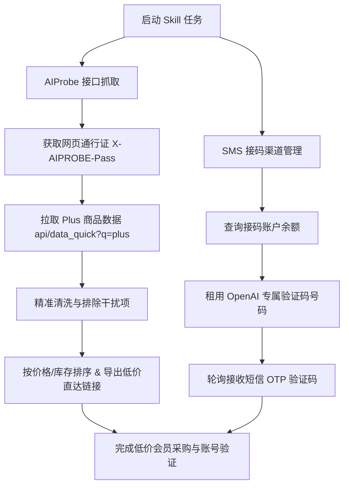

# AIProbe 低价 Plus 会员获取与接码渠道 Skill (aiprobe-plus-buyer)

本 Skill 旨在解决自动检索对比 ChatGPT Plus 低价资源及解决账号注册/升级接码验证的需求。通过集成 `https://aiprobe.top/` 全网 AI 资源聚合接口与主流 SMS 接码平台 API，提供低价商品智能筛选、自动过滤干扰商品、按类型分类比价及短信验证码接码一体化工具。

---

## 核心功能与工作流



---

## 一、AIProbe 数据源抓取原理

### 1.1 通行证与接口说明
- **Web Pass 通行证**: 发送请求至 `https://aiprobe.top/api/web_pass` 获取临时 Token，随请求附带 HTTP Header `X-AIPROBE-Pass`。
- **快搜接口**: `https://aiprobe.top/api/data_quick?q=plus` 返回当前实时上架的 Plus 集中商品。
- **降级备用**: `https://aiprobe.top/data.initial.json` 全量全网索引数据。

### 1.2 商品精准清洗与过滤规则 (Filter & Exclusion Rules)
系统在抓取与解析过程中，会自动应用正则匹配 `EXCLUSION_PATTERN` 严格剔除以下干扰、工具类或低质商品，确保返回的均为真实可用的 Plus 账号与代充值服务：

| 过滤类别 | 排除的关键词 (Exclusion Keywords) | 原因说明 |
| :--- | :--- | :--- |
| **虚假/干扰项** | `非Plus`、`不是Plus`、`不含Plus`、`可升级Plus`、`可开Plus`、`媲美Plus`、`99%开Plus` | 并非直接提供 Plus 权益，仅为广告噱头 |
| **提取/辅助工具** | `提链`、`提炼`、`提取`、`提取支付链接`、`提链助手`、`助手` | 属于外挂提取脚本或工具软件而非账号本身 |
| **扫码登录类** | `扫码`、`二维码`、`扫码登录`、`扫码开通` | 涉及风控风险与扫码授权安全隐患 |
| **免费/低质邮箱** | `free`、`Free`、`免费`、`普号`、`普通号`、`icloud`、`icloud邮箱` | 普通免费号或批量注册低质邮箱，非 Plus 会员 |
| **共享/体验号** | `plus多人体验号`、`开plus绑定专用` | 共享体验号极易封号，非独享正规套餐 |

---

## 二、SMS 接码渠道集成规范

本 Skill 集成了主流 SMS 平台协议（支持 **SMS-Activate** 协议族与 **5SIM** API）：

### 2.1 支持的接码服务商与 API 映射
| 服务商 | 协议类型 | 默认 Base URL | OpenAI 服务代码 |
| :--- | :--- | :--- | :--- |
| **SMS-Activate** | SMS-Activate Standard | `https://api.sms-activate.org/stubs/handler_api.php` | `dr` / `openai` |
| **5SIM** | 5SIM REST API | `https://5sim.net/v1` | `openai` |
| **DaisySMS / TigerSMS / 易码** | SMS-Activate 兼容协议 | 自定义 Endpoint | `dr` / `openai` |

### 2.2 核心操作流程
1. **查询余额**: 确认账户是否有足够点数租用号码。
2. **租用号码**: 指定服务（如 `openai` / `dr`）与国家代码（如 `0` 俄罗斯、`12` 美国、`22` 印度等）。
3. **获取验证码**: 自动轮询查询是否收到 6 位数 SMS OTP，支持超时控制与自动取消。

---

## 三、命令行工具 (CLI) 使用指南

在终端进入 `scripts/` 目录运行 `cli.py`：

### 3.1 检索低价 Plus 会员
```bash
# 获取在售最低价前 15 个 Plus 商品
python cli.py fetch --sort price_asc --limit 15

# 筛选代充类且价格在 100 元以下的 Plus 商品
python cli.py fetch --category 代充/直充 --max-price 100

# 输出原始 JSON 格式（适合自动化脚本读取）
python cli.py fetch --limit 5 --json
```

### 3.2 接码渠道操作
```bash
# 设置环境变量 API Key
export SMS_API_KEY="your_api_key_here"

# 1. 检查接码账户余额
python cli.py sms balance --provider sms-activate

# 2. 租用一个 OpenAI 验证号码
python cli.py sms get-number --service openai --country 0

# 3. 轮询获取短信验证码（指定返回的 Activation ID）
python cli.py sms get-code --id 123456789 --wait 120
```

---

## 四、Python SDK 调用示例

可以直接在自定义 Python 脚本中导入 Skill 核心模块：

```python
from aiprobe_fetcher import AIProbeFetcher
from sms_verifier import SMSClient

# 1. 获取最低价 Plus 成品号/代充
fetcher = AIProbeFetcher()
plus_items = fetcher.fetch_plus_products(in_stock_only=True, sort_by="price_asc")

print(f"找到 {len(plus_items)} 个在售低价 Plus 商品:")
for item in plus_items[:3]:
    print(f"[{item['category_type']}] ¥{item['price']} | 店铺:{item['shop']} | 链接:{item['buy_link']}")

# 2. 调用 SMS 接码模块
sms_client = SMSClient(provider="sms-activate", api_key="YOUR_API_KEY")
success, act_id, phone = sms_client.get_number(service="openai")

if success:
    print(f"已租用号码: +{phone}, ID: {act_id}")
    ok, code = sms_client.get_code(act_id)
    if ok:
        print(f"成功接收验证码: {code}")
```

---

## 五、目录结构

```
aiprobe-plus-buyer/
├── SKILL.md                  # Skill 核心说明与操作指南
├── scripts/
│   ├── aiprobe_fetcher.py    # AIProbe 数据抓取与过滤器
│   ├── sms_verifier.py       # SMS 接码渠道 API 封装
│   ├── cli.py                # 命令行交互工具
│   └── requirements.txt      # Python 依赖清单
└── examples/
    └── usage_examples.py     # Python 代码集成示例
```
