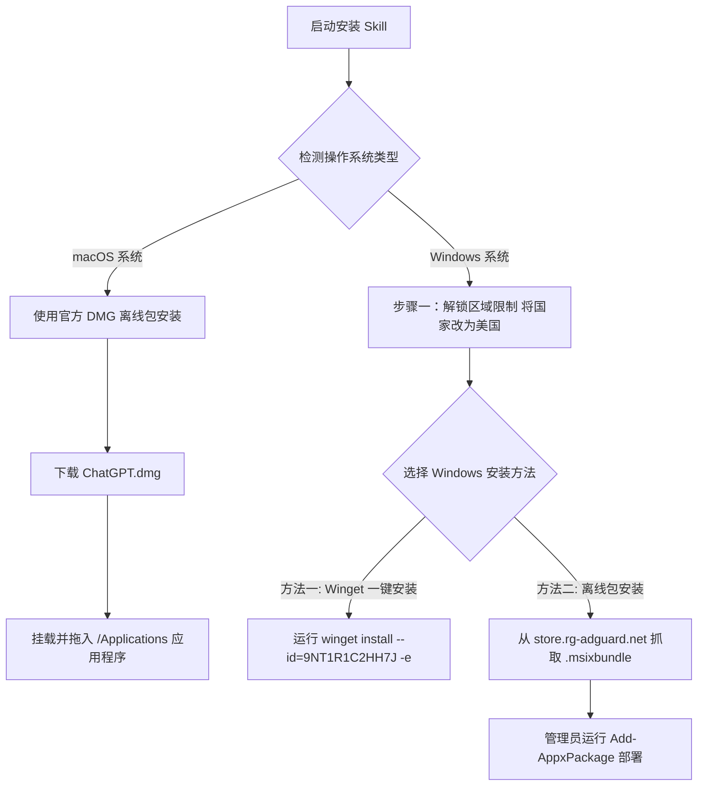

# ChatGPT 桌面版官方全平台安装 Skill (chatgpt-installer-skill)

本 Skill 旨在指导与帮助用户在不同操作系统（macOS 与 Windows）上顺利安装官方 ChatGPT 桌面应用，特别是解决 Windows 平台下“在你所在的地区不可用”及微软商店隐藏应用的限制。

---

## 🧭 系统判断与安装策略



---

## 一、macOS 官方 DMG 离线安装

### 1.1 下载地址
- **官方最新 DMG 离线包地址**: [https://persistent.oaistatic.com/codex-app-prod/ChatGPT.dmg](https://persistent.oaistatic.com/codex-app-prod/ChatGPT.dmg)

### 1.2 安装步骤
1. 点击上方官方链接下载 `ChatGPT.dmg` 文件。
2. 双击打开 `ChatGPT.dmg`，将 `ChatGPT.app` 图标拖入 `Applications`（应用程序）文件夹。
3. 在启动台（Launchpad）或访达应用程序中打开 ChatGPT 登录账号即可使用。

---

## 二、Windows 桌面版安装（完美突破区域限制）

在 Windows 上，由于 OpenAI 在微软商店对中国大陆等地区隐藏了 ChatGPT 桌面版，直接搜索会提示“在你所在的地区不可用”。请按照以下步骤解决：

### 🛑 核心前提：修改 Windows 区域设置
> [!IMPORTANT]
> **这是最关键的一步！** 无论选择 Winget 还是离线包安装，都建议先执行此操作。

1. **打开设置**：按键盘 Win + I 打开 Windows 设置。
2. **定位选项**：点击 **“时间及语言”** -> **“区域”**。
3. **修改地区**：在 **“国家或地区”** 下拉菜单中，将其修改为 **“美国” (United States)**。
   *(注：此修改即时生效，无需重启电脑)*。

---

### 方法一：使用 Winget 命令安装（官方推荐）

这是最快捷的方法，Windows 内置包管理器 Winget 会直接从微软官方服务器抓取并安装应用。

1. 右键点击任务栏“开始”按钮，选择 **“终端 (管理员)”** 或 **“PowerShell (管理员)”**。
2. 复制并执行以下命令：
   ```bash
   winget install --id=9NT1R1C2HH7J -e
   ```
3. 若提示是否同意协议，输入 `Y` 并回车。
4. 等待进度条完成后，即可在“开始”菜单中看到 ChatGPT。

---

### 方法二：手动抓取官方离线安装包（免商店/离线安装）

适合商店被卸载、禁用或 Winget 无法连接的环境。

1. **获取官方直链**：
   - 打开抓包网站: [store.rg-adguard.net](https://store.rg-adguard.net/)
   - 左侧选 **`ProductId`**，中间输入 Product ID: **`9NT1R1C2HH7J`**，右侧选 **`Retail`**，点击搜索。
2. **下载文件**：
   - 在结果列表中找到以 **`.msixbundle`** 结尾的文件（文件大小约 200MB+）。
   - 确认下载域名为 `microsoft.com`，双击或下载保存。
3. **部署安装**：
   - 直接双击下载好的 `.msixbundle` 运行安装。
   - 若双击报错，以管理员身份打开 PowerShell 执行：
     ```powershell
     Add-AppxPackage -Path "C:\你的下载路径\ChatGPT.msixbundle"
     ```

---

## 三、自动化工具使用说明

在 `scripts/` 目录下可以使用 Python 交互工具自动识别系统并指导安装：

```bash
cd c:\Users\gool\Desktop\skilldb\chatgpt-installer-skill\scripts

# 1. 自动检测系统并生成安装指南
python cli.py

# 2. 强行指定系统类型
python cli.py --os windows
python cli.py --os macos
```

---

## 📁 目录结构

```
chatgpt-installer-skill/
├── SKILL.md                          # 本安装指引 Skill 主文档
├── scripts/
│   ├── chatgpt_installer.py          # 跨平台自动检测与引导脚本
│   ├── install_windows_chatgpt.ps1   # Windows 自动化区域检查与 Winget/Appx 部署脚本
│   └── cli.py                        # 命令行交互工具
└── resources/
    └── installer_metadata.json       # macOS DMG 链接与 Windows Store ProductID 数据库
```
