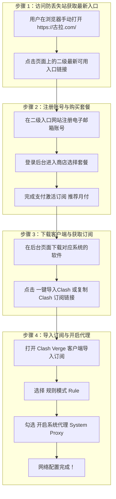

# 古拉 VPN 订阅与 Clash 配置完整指南 (gula-vpn-clash-guide)

> [!IMPORTANT]
> **网站性质特别说明**：`https://古拉.com/` (Punycode: `xn--w4r430a.com`) 是一个**防丢失导航发布站**（静态指向站）。由于科学上网节点域名容易被封锁，该主站不直接提供节点，而是**指向最新的二级真正入口**。因此，必须由用户自己在浏览器中手动打开，点击页面上的二级最新入口按钮进入真正的机场平台。

---

## 🧭 完整四步操作流程



---

## 详细操作步骤说明

### 步骤 1：访问防丢失导航站，获取最新二级入口
1. **手动打开浏览器**：在地址栏输入 `https://古拉.com/`（在部分浏览器中会转换为 Punycode `https://xn--w4r430a.com/`）。
2. **处理打不开/DNS 拦截**：如果页面提示无法访问，请将电脑或手机的 DNS 修改为公共 DNS（如阿里云 `223.5.5.5` 或 `1.1.1.1`），或切换手机 5G/4G 移动网络打开。
3. **点击二级入口**：在页面显眼位置点击 **“最新可用入口”** / **“备用主站地址”**，跳转进入真正的机场注册与登录平台。

---

### 步骤 2：注册账号与购买套餐
1. **注册账号**：进入二级入口网站后，点击右上角 **“注册”**，使用常用邮箱（如 Gmail, Outlook, QQ 邮箱）设置密码。
2. **选择套餐**：
   - 登录后台后，点击左侧菜单 **“商店”** 或 **“购买订阅”**。
   - 根据需求选择月度、季度或年度套餐。
   
   > [!WARNING]
   > **安全与资金提示**：第三方机场存在运营风险，强烈建议**优先选择月付**，切勿一次性充值多年大额费用。

3. **完成支付**：选择支付方式（通常支持支付宝/微信）完成支付，订阅会自动激活。

---

### 步骤 3：下载客户端软件并获取订阅
1. **根据系统下载客户端**：
   - **Windows 用户**: 推荐下载安装 [Clash Verge Rev x64 安装包](https://github.com/clash-verge-rev/clash-verge-rev/releases)。
   - **macOS 用户**: 推荐下载安装 [Clash Verge Rev for Mac](https://github.com/clash-verge-rev/clash-verge-rev/releases) 或 ClashX Meta。
   - **Android 用户**: 推荐下载 [Clash Meta for Android](https://github.com/MetaCubeX/ClashMetaForAndroid/releases)。
   - **iOS 用户**: 使用非中国大陆 Apple ID 在 App Store 下载 Shadowrocket (小火箭)。
2. **获取订阅链接**：回到机场控制台首页 (Dashboard)，找到 **“快速导入”** 区域，点击 **“一键导入 Clash”** 或 **“复制订阅链接”**。

---

### 步骤 4：导入订阅与开启系统代理 (最终搞定 VPN)
1. 打开安装好的 Clash 客户端。
2. 进入 **“订阅” (Profiles)** 页面，粘贴刚刚复制的 Clash 订阅链接，点击 **导入 (Import)**。
3. 鼠标单击选中刚刚导入的配置文件。
4. 进入 **“代理” (Proxies)** 页面，将代理模式切换为 **规则模式 (Rule)**。
5. 进入 **“设置” (Settings)** 页面，开启 **系统代理 (System Proxy)** 开关。
6. 此时全局/规则网络代理生效，即可流畅访问 OpenAI、ChatGPT 与通用受限网络！

---

## 🛠 诊断工具与本地提示 (`scripts/gula_checker.py`)

由于 `古拉.com` 属于静态防丢失跳转站，且命令行自动 Ping/Curl 会被防火墙直接拦截，诊断工具 `gula_checker.py` 主要用于说明防丢失机制并校验用户手动获取到的二级 Clash 订阅链接：

```bash
cd scripts/

# 1. 查看说明与下载源
python cli.py client --platform windows

# 2. 校验用户获取到的二级 Clash 订阅链接 (测试有效性与剩余流量)
python cli.py check-sub --url "你的Clash订阅链接"
```
