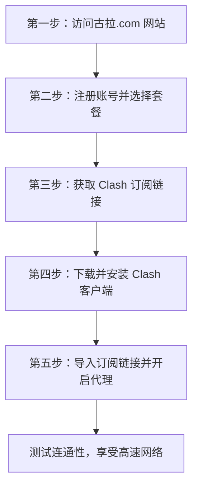

# 古拉 VPN 订阅与 Clash 安装配置全指南 Skill (gula-vpn-clash-guide)

本 Skill 旨在引导用户完成 **古拉 VPN/机场服务 (`https://古拉.com/`)** 的访问、注册、订阅购买，以及在全平台（Windows, macOS, Android, iOS）上安装、配置和使用 **Clash** 客户端。

---

## 🧭 整体流程概览



---

## 一、访问 `古拉.com` 网站与订阅服务

### 1.1 域名说明与访问避坑
- **中文域名与 Punycode 转码**：在浏览器中输入 `https://古拉.com/` 时，部分浏览器或网络安全组件会自动转码为 Punycode 格式：`https://xn--w4r430a.com/`。二者指向同一个网站。
- **访问打不开/DNS 污染处理**：
  > [!TIP]
  > 如果直接打不开 `古拉.com`，可以尝试：
  > 1. 将电脑或手机 DNS 改为公共 DNS，如 `223.5.5.5` (阿里云) 或 `1.1.1.1` (Cloudflare)。
  > 2. 使用手机移动网络（5G/4G）尝试打开。
  > 3. 使用已有的临时代理网络访问。

### 1.2 注册与选择订阅套餐
1. **注册账号**：
   - 打开网站首页，点击右上角 **“注册”**。
   - 输入你的电子邮箱（建议使用 Gmail、Outlook 或 QQ/163 邮箱）和设置密码。
2. **选择套餐**：
   - 登录后台后，进入左侧菜单 **“购买订阅”** 或 **“商店”**。
   - 根据需求选择适合的流量套餐（如体验版、月度版、年度版）。
   
   > [!WARNING]
   > **安全与资金防范提醒**：第三方网络代理（机场）存在服务波动或运营风险。强烈建议**优先选择月付（按月订阅）**，切勿一次性支付多年大额费用，以降低风险。

3. **支付并激活**：
   - 选择支付方式（通常支持支付宝、微信支付或加密货币），完成支付后套餐即刻生效。

### 1.3 获取 Clash 订阅链接
1. 支付完成后回到控制面板首页（Dashboard）。
2. 在 **“快速导入”** / **“订阅信息”** 区域，找到 **“一键导入 Clash”** 或 **“复制 Clash 订阅链接”**。
3. 点击复制按钮，系统会将类似 `https://xn--w4r430a.com/api/v1/client/subscribe?token=xxxx` 的订阅链接复制到剪贴板。

---

## 二、全平台 Clash 客户端下载与安装指南

### 2.1 Windows 平台（推荐 Clash Verge Rev）

#### 软件下载
- **推荐客户端**: **Clash Verge Rev**（现代界面，基于 Tauri，开源轻量）
- **官方下载地址**: [GitHub Releases](https://github.com/clash-verge-rev/clash-verge-rev/releases)

#### 安装与配置步骤
1. 下载 `Clash.Verge_x64-setup.exe` 并完成安装。
2. 打开 Clash Verge：
   - 点击左侧菜单 **“订阅” (Profiles)**。
   - 在顶部输入框粘贴从古拉网站复制的 **Clash 订阅链接**。
   - 点击右侧 **“导入” (Import)** 按钮。
3. 导入成功后，鼠标**单击选中**刚刚导入的订阅配置文件。
4. 点击左侧菜单 **“代理” (Proxies)**，在顶部选择 **Rule (规则模式)**。
5. 点击左侧菜单 **“设置” (Settings)**，开启 **“系统代理” (System Proxy)**。
   - （可选）勾选 **“开机自启” (Auto Launch)**。

---

### 2.2 macOS 平台（推荐 Clash Verge Rev / ClashX Meta）

#### 软件下载
- **推荐客户端**: **Clash Verge Rev (macOS)** 或 **ClashX Meta**
- **官方下载地址**: [Clash Verge Rev GitHub](https://github.com/clash-verge-rev/clash-verge-rev/releases) / [ClashX Meta GitHub](https://github.com/MetaCubeX/ClashX.Meta/releases)

#### 安装与配置步骤
1. 下载 `.dmg` 文件（Apple Silicon 芯片选择 `aarch64.dmg`，Intel 芯片选择 `x64.dmg`）。
2. 将软件拖入 `Applications`（应用程序）文件夹。
3. 首次打开如提示“身份不明开发者”，请在 macOS **系统设置 -> 隐私与安全性** 中点击“仍要打开”。
4. 打开软件，进入 **订阅管理 (Profiles)** 粘贴古拉 Clash 订阅链接并导入。
5. 勾选 **设置系统代理 (Set as System Proxy)**。

---

### 2.3 Android (安卓) 平台（推荐 Clash Meta for Android）

#### 软件下载
- **推荐客户端**: **Clash Meta for Android (CMFA)** 或 **Surfboard (冲浪板)**
- **官方下载地址**: [Clash Meta for Android GitHub](https://github.com/MetaCubeX/ClashMetaForAndroid/releases)

#### 安装与配置步骤
1. 下载 `.apk` 文件并在安卓手机上安装。
2. 打开软件，点击 **“配置” (Profiles)** -> **“新配置” (New Profile)** -> **“URL 导入”**。
3. 输入名称（如 `古拉VPN`），在 URL 框中粘贴订阅链接，点击右上角保存。
4. 返回主界面，选中该配置，点击右下角 **“已停止 / 点击启动”** 按钮启动 VPN 代理服务。

---

### 2.4 iOS (iPhone / iPad) 平台

> [!NOTE]
> 由于 iOS 系统限制，代理软件需要使用非中国大陆区 Apple ID 在 App Store 下载。

#### 推荐软件
1. **Shadowrocket (小火箭)** - 售价 $2.99，功能全面，一键导入。
2. **Stash** - 售价 $3.99，iOS 端的代理神器。

#### 配置步骤（以 Shadowrocket 为例）
1. 打开 iOS App Store，切换登录美区/港区 Apple ID 并搜索下载 **Shadowrocket**。
2. 打开古拉.com 网站后台，点击 **“一键导入 Shadowrocket”**（软件会自动唤醒并添加节点）。
3. 或打开 Shadowrocket 手动添加：点击右上角 `+` -> 类型选择 `Subscribe` -> 粘贴古拉订阅链接 -> 保存。
4. 勾选刚才添加的订阅，开启顶部 **“未连接”** 开关，首次允许系统添加 VPN 配置。

---

## 三、常用代理模式区别与推荐设置

| 代理模式 | 英文标识 | 工作原理说明 | 推荐使用场景 |
| :--- | :--- | :--- | :--- |
| **规则模式 (推荐)** | **Rule** | 国内流量直接连接，国外受限网站（如 Google, YouTube, ChatGPT）自动走节点代理 | 日常上网、看视频、兼顾国内 APP 速度 |
| **全局模式** | **Global** | 所有网络流量强制经过选择的代理节点 | 当某些国外网站规则失效或打不开时临时切换 |
| **直连模式** | **Direct** | 不经过任何代理节点，所有流量直连 | 临时关闭代理 |

---

## 四、常见问题诊断与工具助手

终端内置了自动诊断命令行工具，支持测试连通性与校验订阅有效性：

在 `scripts/` 目录下运行：

```bash
# 1. 检查 古拉.com 网站连通性
python cli.py check-site

# 2. 校验 Clash 订阅链接 (测试节点数与流量)
python cli.py check-sub --url "你的Clash订阅地址"

# 3. 查看全平台 Clash 客户端官方下载源
python cli.py client --platform all
```

---

## 📁 目录结构

```
gula-vpn-clash-guide/
├── SKILL.md                          # 本完整指引文档
├── scripts/
│   ├── gula_checker.py               # 古拉.com 连通性与订阅有效性诊断脚本
│   ├── clash_installer.py            # 全平台 Clash 软件下载源管理
│   └── cli.py                        # 命令行交互工具
└── resources/
    └── clash_download_links.json     # 官方客户端下载链接数据库
```
