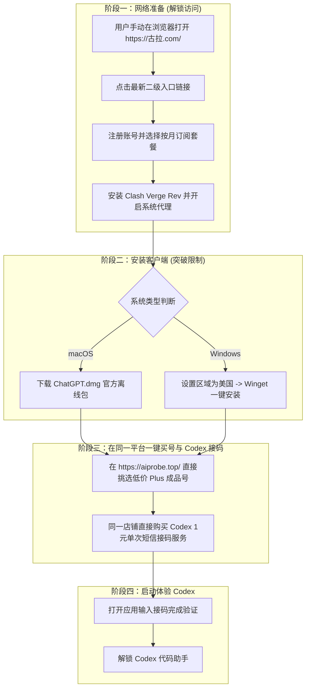

# 小白国内使用 OpenAI Codex 从零到一极简通关指南 (/sk-codex-beginner)

针对中国大陆零基础用户（小白），提供一条**极简通关路径**。不需要繁琐去国外平台注册充值，所有账号与 **Codex 手机接码服务**均可在同一网站统一直接购买！

---

## 🧭 0 到 1 全流程通关路线图



---

## 💡 为什么小白全流程超简单？

1. **不需要去国外网站繁琐接码**：
   在 `https://aiprobe.top/` 同一个聚合平台上，售卖 Plus 账号的同一个店铺（如 *一梦AI*、*ai小头*、*奥特曼严选* 等）直接就上架了 **“Codex 专属短信接码服务”**（单次约 1.12元 ~ 2.00元）。
2. **像买卡密一样直接下单**：
   无需注册国外平台或换汇，直接在店铺下单获取 Codex 验证服务，提交接收 6 位数验证码即可！

---

## 阶段一：网络准备 (解决打不开与 403 阻断)

1. **手动访问防丢失发布站**：在浏览器打开 `https://古拉.com/` (Punycode: `https://xn--w4r430a.com/`)。
2. **点击最新二级入口**：点击页面上的最新入口按钮进入真正的平台，注册账号并按月订阅套餐。
3. **下载安装 Clash 客户端**：
   - **Windows**: 下载 [Clash Verge Rev x64 安装包](https://github.com/clash-verge-rev/clash-verge-rev/releases)。
   - **macOS**: 下载 [Clash Verge Rev for Mac](https://github.com/clash-verge-rev/clash-verge-rev/releases)。
4. **导入并连接代理**：后台点击 **“一键导入 Clash”**，软件中选择 **规则模式 (Rule)**，开启 **系统代理 (System Proxy)**。

---

## 阶段二：安装 ChatGPT / Codex 桌面版

- **macOS**: 直接下载官方 DMG 离线包 [ChatGPT.dmg](https://persistent.oaistatic.com/codex-app-prod/ChatGPT.dmg)，拖入 `Applications` 文件夹。
- **Windows**: 
  1. 按 **Win + I** 打开设置 -> 时间及语言 -> 区域 -> 将国家修改为 **美国 (United States)**（即时生效）。
  2. 以管理员身份打开终端运行：`winget install --id=9NT1R1C2HH7J -e`。

---

## 阶段三：同一店铺一键买号与 Codex 接码

1. 打开 `https://aiprobe.top/`。
2. **购买账号/Plus 会员**：直接检索低价带质保的 ChatGPT / Codex 成品号或 Plus 套餐。
3. **一键购买 Codex 接码**：搜索 `Codex接码` 或在同一店铺直接购买 `GPT Plus / Codex 短信接码服务` 卡密（单次仅需 1 元左右）。
4. 将接码卡密给到客服或在提取页提交，接收 6 位数验证码填入应用完成激活！

---

## 阶段四：启动体验 Codex

1. 打开安装好的桌面应用，输入激活通过的账号。
2. 即可开始在应用中流畅体验 OpenAI Codex 智能编程助手！

---

## 💻 检索 Codex 接码服务命令

```bash
cd c:\Users\gool\Desktop\skilldb\skills\aiprobe-plus-buyer\scripts
python cli.py fetch --category 接码服务 --limit 5
```
