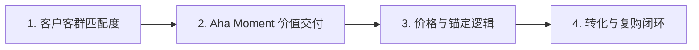

# 商业诊断 Skill (/sk-diagnosis)

本 Skill 用于对业务、产品、定价及销售转化卡点进行深度诊断，排除非核心干扰，直击业务第一原理。

---

## 🔍 诊断四步模型



### 诊断维度清单：
1. **客群契合 (PMF)**：是否找错了目标用户？（例：向价格敏感型群体销售高客单服务）。
2. **价值感知**：产品是否在前 7 天让用户体验到极简 Aha Moment？
3. **定价锚定**：是否有清晰的对标参照物与 ROI 证明？
4. **续费/复购障碍**：瓶颈在产品本身、交付体验，还是缺乏长期钩子？

---

## 使用示例

```bash
/sk-diagnosis 我做少儿编程课，已经有 40 个付费学员，但续费率很低。我需要判断问题出在产品、定价，还是找错了客户。
```
