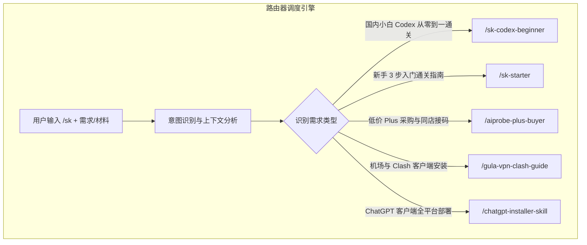

# 主分发路由器 Skill (/sk)

`sk` 是 Skill System 的总指挥与调度路由器。用户无需记忆具体的 Skill 名称，只需在命令前加 `/sk`，系统会自动调度最契合的通关 Skill。

---

## 🧭 路由逻辑架构



---

## 核心功能规范

1. **自动识别与分发**：根据用户输入的描述，匹配相应的通关 Skill。
2. **多轮引导**：在完成某一阶段操作后，提示下一步可调用的子技能（如：代理配置完成后，引导使用 `/chatgpt-installer-skill`）。

---

## 使用示例

```bash
# 智能分析
/sk 我是国内小白，想从零开始配置 ChatGPT 和使用 Codex 编程，怎么操作？

# 系统转接至 /sk-codex-beginner 并输出通关路线
```
