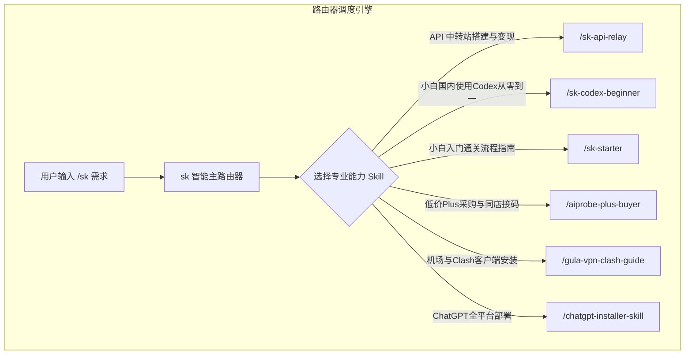

# 主分发路由器 Skill (/sk)

`sk` 是 Skill System 的总指挥与调度路由器。用户无需记忆具体的 Skill 名称，只需在命令前加 `/sk`，系统会自动调度最契合的通关 Skill。

---

## 🧭 路由逻辑架构



---

## 核心功能规范

1. **自动识别与分发**：根据用户输入的描述，匹配相应的通关 Skill。
2. **多轮引导**：在完成某一阶段操作后，提示下一步可调用的子技能（如：搭建中转站后，引导使用 `/aiprobe-plus-buyer` 采购渠道）。

---

## 使用示例

```bash
# 智能分析中转站变现
/sk 想搭建一个大模型 API 中转站卖 key 赚钱，怎么操作？

# 系统转接至 /sk-api-relay 并输出从部署到发卡的全套路线
```
