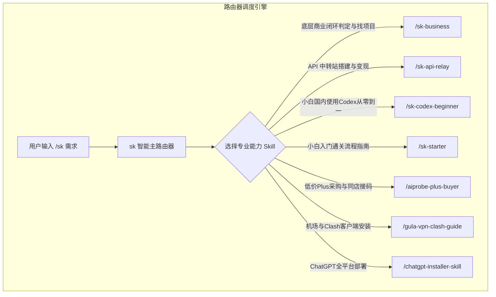

# 主分发路由器 Skill (/sk)

`sk` 是 Skill System 的总指挥与调度路由器。用户无需记忆具体的 Skill 名称，只需在命令前加 `/sk`，系统会自动调度最契合的通关 Skill。

---

## 🧭 路由逻辑架构



---

## 核心功能规范

1. **商业闭环判决**：优先基于 `/sk-business` 进行【流量 ➔ 转化 ➔ 交付】判定，评估用户需求是否具备商业闭环。
2. **自动识别与分发**：根据用户输入的描述，匹配相应的通关 Skill。
3. **多轮引导**：在完成某一阶段操作后，提示下一步可调用的子技能（如：判定完中转站项目后，引导使用 `/sk-api-relay` 部署与搭建）。

---

## 使用示例

```bash
# 评估商业闭环与找对标
/sk 怎么判断一个 AI 项目能不能赚钱？怎么在自媒体上找对标？

# 系统转接至 /sk-business 并输出商业闭环判定模型与自媒体 4 步模仿法
```
