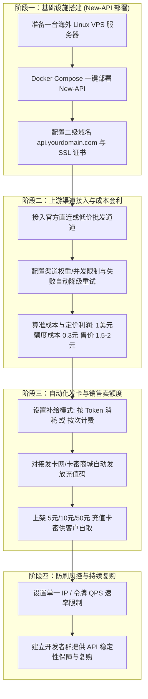

# 大模型 API 中转站商业变现完整指南 (/sk-api-relay)

大模型 API 中转服务（API Relay / Proxy Station）是将 OpenAI, Claude, Midjourney 等大模型 API 接口统一封装，销售给开发者、企事业单位、AI 应用开发者及小白用户的**高毛利商业变现模式**。

本技能提供从 **0 到 1 搭建中转站、成本套利计算、发卡销售到高并发风控** 的完整闭环方案。

---

## 🧭 0 到 1 API 中转站变现通关路线图



---

## 💡 为什么 API 中转站是极佳的变现模式？

1. **刚性需求大**：国内大量独立开发者、企业与 Prompt 工程师无法直接绑定海外信用卡调用 OpenAI/Claude 接口，必须依赖中转 API。
2. **高毛利套利**：上游批量采买大额通道（成本约 1 美元额度 = 0.3~0.5 元人民币），零售卖给开发者（售价 1 美元额度 = 1.2~2.0 元人民币），**毛利率高达 60% - 80%**。
3. **自动化被动收入**：充值卡发卡网 24 小时自动发货，系统自动扣费与充值，无需人工干预。

---

## 阶段一：服务器准备与 New-API 一键部署

### 1. 硬件要求
- **服务器**：推荐使用海外轻量云服务器（如香港、东京、新加坡、美国 VPS，1核 2GB 内存以上即可）。
- **域名**：准备一个已解析的二级域名（如 `api.yourdomain.com`）。

### 2. Docker Compose 极速部署 New-API
在服务器终端运行：

```bash
# 1. 创建项目目录
mkdir -p /opt/new-api && cd /opt/new-api

# 2. 创建 docker-compose.yml
cat << 'EOF' > docker-compose.yml
version: '3.9'
services:
  new-api:
    image: calciumion/new-api:latest
    container_name: new-api
    restart: always
    command: --log-dir /app/logs
    ports:
      - "3000:3000"
    volumes:
      - ./data:/data
      - ./logs:/app/logs
    environment:
      - TZ=Asia/Shanghai
EOF

# 3. 启动服务
docker compose up -d
```

启动后访问 `http://服务器IP:3000`，默认管理员账号为 `root`，初始密码为 `123456`（*登录后必须立即修改密码*）。

---

## 阶段二：上游渠道接入与套利定价公式

### 1. 渠道配置策略
进入 New-API 管理后台 -> **渠道** -> **添加渠道**：
- **渠道类型**：选择 `OpenAI` / `Claude` / `Midjourney` / `通用`。
- **密钥 (Key)**：填入上游 API Key。
- **代理/Base URL**：如填入官方或第三方反代地址。
- **高可用分组**：设置不同的优先级（Priority）与权重（Weight），开启**“失败时自动重试其他渠道”**，确保 API 99.9% 稳定率。

### 2. 商业定价与利润计算公式

$$\text{利润} = \text{销售价格} - \text{上游采购成本}$$

- **推荐基准定价规则**：
  - **默认模型倍率**：`gpt-4o` / `claude-3-5-sonnet` 设为 `1.0`（跟官方比例一致）。
  - **分组倍率**：
    - **普通用户组**：设置为 `1.5`（即消费 1 美元额度折算 1.5 倍 Token）。
    - **VIP 开发者组**：设置为 `1.0`（需一次性充值 100 元以上）。

---

## 阶段三：发卡网对接与自动充值

1. 进入 New-API 后台 -> **兑换码** -> **批量生成兑换码**。
2. 生成面值为 $1 (约 ¥7 额度)、$5、$10、$50 的兑换卡密。
3. 将卡密上架至自动发卡平台（如 `pay.ldxp.cn`），设置商品标题：
   - `【API中转额度】OpenAI/Claude/Codex 通用 API 充值卡 5美元额度`
4. 客户购买后获得兑换码，在 New-API 后台点击 **充值 (Top-up)** 即可自动增加额度并生成专属 `sk-xxx` API Key 调用。

---

## 阶段四：高并发风控与防刷安全

1. **防恶意刷量**：在 New-API 系统设置中，开启 **“单个令牌 QPS 限制”**（如最高 10 请求/秒）。
2. **频率限制**：对匿名试用账户开启限制，避免被恶黑产爬虫刷爆 Token。
3. **渠道质保**：每日在后台监控“日志”，清理响应超时或失效的废键。

---

## 💻 技能 CLI 命令行快速测试

```bash
cd c:\Users\gool\Desktop\skilldb\skills\sk-api-relay-monetization\scripts
python cli.py --help
```
