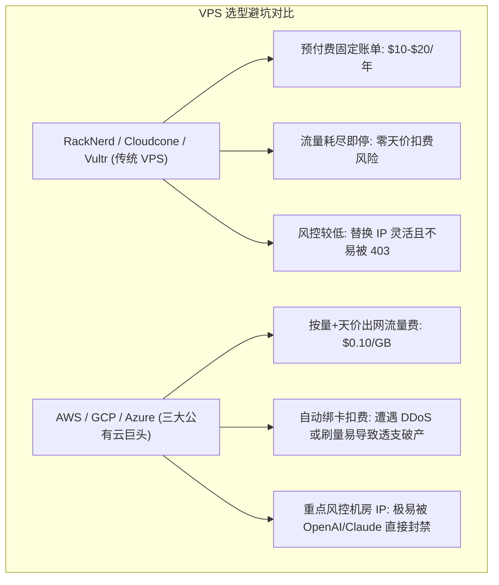

# 大模型 API 中转站商业变现与真实项目部署指南 (/sk-api-relay)

> [!IMPORTANT]
> **拒绝模糊概念与幻觉误导**：本指南只针对 GitHub 上**物理真实存在**的开源大模型中转与代理项目（如 `sub2api`、`calciumion/new-api`、`songquanpeng/one-api`）进行精准拆解与部署说明，绝不推荐无关的第三方插件。

---

## 🧭 物理真实开源项目选型与底层运作机制

### 1. 真实开源项目一览

| 开源项目名称 | GitHub 物理仓库 | 核心功能与运作原理拆解 |
| :--- | :--- | :--- |
| **Sub2API** | `sub2api/sub2api` | **订阅号池转 API 平台**：专门用于将多个 ChatGPT Plus / Claude 官方订阅账号通过 SessionToken / RefreshToken 转化为标准的 OpenAI 格式 API 端口。 |
| **New-API** | `calciumion/new-api` | **企业级大模型聚合网关**：基于 One-API 深度优化的二开系统。负责多节点聚合、多渠道负载均衡、失败无感自动重试、CDK 兑换码生成与模型分组倍率扣费。 |
| **One-API** | `songquanpeng/one-api` | **经典大模型分发系统**：最早的开源 LLM API 管理统一接入与二次分发平台。 |
| **CLI Proxy API** | `cli-proxy-api` / `router-protocol` | **命令行代理转接 API**：将基于 OAuth/网页认证的 CLI 终端工具（如 Claude Code / Codex）封装暴露为标准 OpenAI/Claude API 接口。 |

---

## 二、 服务器购置：为什么选 RackNerd/Vultr 而不是 AWS/GCP/Azure？

新手在选择服务器时，常困惑“为什么推荐 RackNerd / Cloudcone / Vultr，而不是 AWS、GCP 或 Azure？”：



### 1. 核心对比维度表

| 评估维度 | **RackNerd / Cloudcone / Vultr (推荐)** | **AWS / GCP / Azure (不推荐新手)** |
| :--- | :--- | :--- |
| **扣费机制** | **预付费固定账单**（年费 $10~$20 / 月费 $1.5~$3 刀，含固定 1TB~3TB 流量）。 | **后付费按量扣费**，出网流量费极贵（$0.09~$0.12/GB），极易产生天价账单。 |
| **资金风险** | **流量用完自动挂起**，绝不会产生隐藏天价扣费。 | 必须绑定外币信用卡，若遭遇攻击或恶意刷流量，信用卡会被透支几千美元（“AWS 破产套路”）。 |
| **OpenAI / Claude 风控** | IP 段相对分散，更换 IP 成本低且灵活。 | 属于重点风控的大型数据中心 IP 段，极易遭 OpenAI/Claude 报 403 或拦截封号。 |
| **新手操作门槛** | 控制台极简，一键连接终端部署 Docker。 | 包含庞大复杂的 IAM 权限、VPC 局域网、安全组配置，小白调试极其困难。 |

---

## 三、 利用 AI 驱动服务器自动化部署

小白站长无需熟记 Linux 命令，可使用具备 SSH 执行能力的 AI Agent（如 Claude Code, Antigravity 或终端 AI 插件）直接向 AI 下达部署指令：

#### 提示词模板 (Prompt)：
> *"我刚购置了一台 Ubuntu 22.04 海外 VPS（IP: xxx.xxx.xxx.xxx），请帮我自动执行以下动作：1. 安装 Docker 与 Docker-Compose；2. 部署 sub2api/sub2api 容器；3. 配置 Caddy 反向代理并申请 api.mydomain.com 的 SSL 证书。"*

#### 自动化部署脚本命令：

```bash
# 1. 自动安装 Docker
curl -fsSL https://get.docker.com | sh
systemctl enable --now docker

# 2. 创建 Sub2API 目录与 Docker-Compose 配置
mkdir -p /opt/sub2api && cd /opt/sub2api

cat << 'EOF' > docker-compose.yml
version: '3.9'
services:
  sub2api:
    image: sub2api/sub2api:latest
    container_name: sub2api
    restart: always
    ports:
      - "8080:8080"
    environment:
      - TZ=Asia/Shanghai
    volumes:
      - ./data:/app/data
EOF

# 3. 启动 Sub2API
docker compose up -d
```

---

## 四、 收单发卡与成本评估定价模型

### 1. 收单流程（联动小铺 / 发卡网卖 CDK）
1. 站长在 `New-API` 或 `Sub2API` 后台批量生成指定面额的 **CDK 兑换码**（如 5元、10元、50元）。
2. 将 CDK 上架至**联动小铺发卡网**，客户付款后系统自动发放卡密。
3. 客户在 API 中转站点击“充值 (Top-up)”，输入卡密即可瞬间兑换为额度生成 API Key。

---

### 2. 成本评估与定价公式

$$\text{月度总运维成本 (Cost)} = \text{VPS服务器月费} + \text{域名摊销} + \text{Plus账号采购成本} + \text{住宅 IP 代理费}$$

- **两大定价变现路线**：
  1. **低价 10% 薄利跑大流水模式（推荐）**：将售价定为 **2.0 元 / $ 额度**（微幅加价 10%~15%），靠 Skill 教程自媒体引流和低价优势做大用户量与每日 Token 消耗流水，获得稳健的被动收入。
  2. **高毛利模式**：将售价定为 **2.8 ~ 3.5 元 / $ 额度**，提供一对一远程安装指导与技术支持。

---

## 💻 技能 CLI 命令行快速测试

```bash
cd c:\Users\gool\Desktop\skilldb\skills\sk-api-relay-monetization\scripts
python cli.py --help
```
