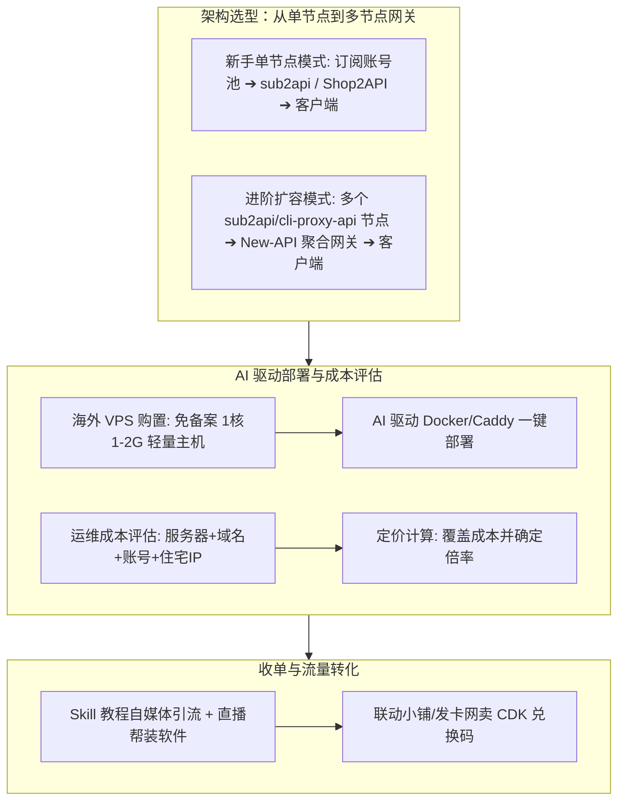

# 大模型 API 中转站商业变现与技术搭建全指南 (/sk-api-relay)

大模型 API 中转服务（API Relay / Proxy Station）是将 OpenAI, Claude, Midjourney 等大模型 API 接口统一封装，销售给开发者、企事业单位、AI 应用开发者及小白用户的**高毛利/高流水商业变现模式**。

---

## 🧭 架构演进与商业闭环总全景图



---

## 一、 核心开源仓库与软件架构选型

### 1. 核心开源组件仓库

- **`sub2api` / `Shop2API`**
  - **定位**：专门用于将单个或多个 ChatGPT Plus / Claude 官方订阅账号转化为标准 OpenAI API 格式的转接与号池管理系统。
  - **功能**：自动管理账号 Session/RefreshToken、自动轮询账号池、处理模型映射与 Token 统计。
- **`cli-proxy-api` / `cliproxyapi`**
  - **定位**：轻量级命令行代理转 API 工具，适合快速单机部署与代理桥接。
- **`New-API` / `One-API`**
  - **定位**：多节点统一聚合网关与分发路由系统。

---

### 2. 架构演进路线：新手单节点 ➔ 进阶多节点

#### 阶段 A：新手单节点模式 (`Shop2API` / `sub2api` 单机)
针对刚入门的小白站长，无需构建复杂的多机集群：
- 直接在单台海外 VPS 上部署一个 `sub2api` 或 `Shop2API` 实例。
- 绑定 1~3 个 Plus 订阅账号构建底层账号池。
- 用户直接调用 `sub2api` 提供的 API 地址或使用 CDK 兑换余额。

#### 阶段 B：中后期多节点扩容模式 (`Shop2API` 多节点 + `New-API` 聚合网关)
当业务量和并发 QPS 增长后：
- 在不同地区的服务器（如香港、东京、美西）部署多个 `sub2api` / `cli-proxy-api` 转接节点。
- 在顶层部署 `New-API` 作为统一控制台与路由网关。
- `New-API` 负责聚合所有节点，做跨节点的**负载均衡、失败无感自动重试与多租户计费**。

---

## 二、 服务器购置与 AI 辅助自动化部署

### 1. 服务器购置策略

| 评估维度 | 推荐方案与细节说明 |
| :--- | :--- |
| **购买渠道** | **必须购买海外云服务器 VPS**（如 RackNerd、Cloudcone、Vultr、DigitalOcean、雨云海外 VPS 等）。<br>❌ *绝对不要用国内云服务器*（必须 ICP 备案且存在网络封锁风险）。 |
| **配置与策略** | 新手初期选择**低成本轻量云主机**（如 1核 1GB/2GB 内存，月费仅约 $1.5~$3 刀 / 年费约 $10~$20 刀）。<br>待日均 Token 消耗量增多后再弹性扩容。 |

---

### 2. 利用 AI 控制服务器与极速部署

小白站长无需学习复杂的 Linux 运维命令，可通过支持 SSH / Shell 执行的 AI Agent（如 Claude Code, Antigravity 或 SSH 连线）提示 AI 自动完成以下部署：

#### 提示词示例 (Prompt 用法)：
> *"我刚购买了一台 Ubuntu 22.04 海外 VPS，请帮我自动安装 Docker、Docker-Compose、安装 Caddy 申请 api.mydomain.com 的 SSL 证书，并用 Docker 部署最新版的 sub2api/Shop2API。"*

#### 自动化部署 Shell 脚本命令（供 AI 或运维自动执行）：

```bash
# 1. 一键安装 Docker 环境
curl -fsSL https://get.docker.com | sh
systemctl enable --now docker

# 2. 创建 sub2api 工作目录与配置
mkdir -p /opt/sub2api && cd /opt/sub2api

cat << 'EOF' > docker-compose.yml
version: '3.9'
services:
  sub2api:
    image: sub2api/sub2api:latest
    container_name: sub2api
    restart: always
    ports:
      - "8080:8080"
    environment:
      - TZ=Asia/Shanghai
    volumes:
      - ./data:/app/data
EOF

# 3. 启动服务
docker compose up -d
```

---

## 三、 收单与收费方式 (CDK 卡密充值)

对于新手而言，对接复杂的海外支付网关（如 Stripe/PayPal）门槛过高且易遭冻结，**强烈推荐 CDK 兑换码模式**：

1. **收单渠道**：使用**联动小铺**或各大开源/第三方自动发卡网（如发卡网商城）。
2. **收费流程**：
   - 站长在 `sub2api` / `New-API` 后台批量生成指定面额的 **CDK 兑换码**（如 5元、10元、50元、100元面额）。
   - 将 CDK 上架至联动小铺发卡网，客户支持微信/支付宝一键付款。
   - 付款后系统自动发货 CDK 卡密，客户在 API 中转站后台点击“卡密充值”，即可瞬间兑换为额度并生成 API Key。

---

## 四、 成本评估与精细化定价模型

在最终为中转 API 定价前，**必须先精确评估服务器与全套运维成本**，以确保覆盖成本并获得稳定的净利润。

### 1. 全套运维成本计算公式

$$\text{月度总运维成本 (Cost)} = \text{VPS服务器月费} + \text{域名摊销} + \text{Plus账号采购成本} + \text{住宅 IP 代理费}$$

- **成本构成明细**：
  - **海外 VPS 成本**：约 ¥15 ~ ¥30 / 月
  - **域名成本**：约 ¥5 / 月（以年费 60 元计算）
  - **Plus 订阅号池成本**：按采购的 Plus 账号数量计算（如采购 2 个独享号，约 ¥280 / 月）
  - **住宅 IP (Proxy) 成本**：按流量或月租计算（约 ¥30 ~ ¥50 / 月，防止多号共用 IP 导致联动封号）

### 2. 科学定价与倍率算法

假设月度总运维成本为 $\text{Cost} = 350 \text{ 元}$，预计提供总额度 $\text{Quota} = \$200 \text{ 美元}$：

$$\text{保本单价/美元额度} = \frac{350 \text{ 元}}{200 \text{ 美元}} = 1.75 \text{ 元 / \$}$$

- **售卖定价方案**：
  - **薄利多销模式（加价 10%~20%）**：将 CDK 售价定为 **2.0 元 / $ 额度**。凭极低价格吸引大量开发者，靠大流水获得稳定被动收益。
  - **高毛利模式（加价 50%+）**：将售价定为 **2.8 ~ 3.5 元 / $ 额度**，适合走定制化小圈子、提供一对一技术调试指导的服务。

---

## 💻 技能 CLI 命令行快速测试

```bash
cd c:\Users\gool\Desktop\skilldb\skills\sk-api-relay-monetization\scripts
python cli.py --help
```
