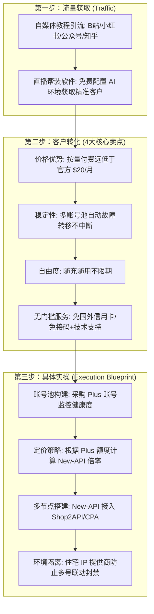

# 大模型 API 中转站商业变现完整指南 (/sk-api-relay)

大模型 API 中转服务（API Relay / Proxy Station）是将 OpenAI, Claude, Midjourney 等大模型 API 接口统一封装，销售给开发者、企事业单位、AI 应用开发者及小白用户的**高毛利商业变现模式**。

---

## 🧭 商业闭环三步法 (流量 ➔ 转化 ➔ 实操)



---

## 1. 流量获取 (Traffic Acquisition)

精准客户不是靠投广告，而是靠**输出有价值的 AI 内容与实操交付**：

1. **自媒体内容引流**：
   - **渠道选择**：小红书、B站、知乎、微信公众号、抖音。
   - **内容切入点**：发布《国内小白如何用上 ChatGPT/Codex》、《AI 独立开发实战指南》、《小白必看的大模型 API 接入工具教程》。
   - **钩子设置**：在文章/视频评论区与私信提供免费测试 Key（如包含 $0.5 试用额度），引导加入开发者交流群。
2. **直播交付引流 (极高转化率)**：
   - **直播形式**：开启“免费帮小白远程安装 AI 软件/配置本地环境/调试 API 接口”直播。
   - **痛点击穿**：小白用户在配置过程中最大的卡点是“没有官方卡”和“不知道怎么调 API”。直播帮装完后，直接顺势推荐自建的中转 API，**现场即可实现 80%+ 转化**。

---

## 2. 客户转化 (Customer Conversion & 4 大核心卖点)

在面对客户咨询时，无需硬推技术术语，重点向客户突出以下 **4 大核心切中痛点的卖点**：

| 核心卖点 | 客户痛点 | 解决方案与说术 |
| :--- | :--- | :--- |
| **(a) 价格优势** | 官方订阅昂贵 ($20/月或 200+ 人民币)，轻度用户用不完 | **按量计费，用多少扣多少**。充值 10 元/20 元就能用很久，门槛极低。 |
| **(b) 稳定性保证** | 个人购买单号容易遭遇 OpenAI 批量风控封号，迁移麻烦 | **多账号池与高可用通道**。底层采用 New-API 多节点兜底，单个账号失效自动无感切号，保证 99.9% 连通率。 |
| **(c) 充值自由度** | 官方按月扣费，不过期失效，使用不灵活 | **随充随用，余额永久有效**。随时充值，余额不过期，无月度续费压力。 |
| **(d) 极简无门槛服务** | 小白不会搞海外信用卡、国外手机号接码 | **完全零门槛，提供一对一技术支持**。无需注册国外账号、免信用卡，提供详细 API 接入指南与故障解答。 |

---

## 3. 具体实操 (Technical & Operational Blueprint)

### (a) 账号管理与账号池健康度维护
- **账号采购**：采购独享 Plus 账号或高额度官方账号构建底层账号池。
- **健康度监控**：在 New-API 后台开启自动测活机制，自动清理响应超时或被封禁的废键，保持账号池高可用。

### (b) 精细定价策略与倍率算力控制
根据 Plus 账号的采购成本与每周可消耗额度（例如单号每周 $120 额度折算成本），计算单个 Plus 的实际折算成本：

$$\text{单美元额度成本} = \frac{\text{Plus 账号采购成本}}{\text{实际可消耗额度 (\$)}}$$

- **New-API 模型倍率设置**：
  - **热门模型** (`gpt-4o`, `claude-3-5-sonnet`)：倍率设置为 `1.0` ~ `1.2`。
  - **VIP 分组/普通分组**：
    - 普通散客组：设置分组倍率 `1.5`（即获得 50% 毛利空间）。
    - 开发者/大客户组：设置分组倍率 `1.0`（需单次充值 100 元以上，走量薄利多销）。

### (c) 多节点搭建与 API 聚合 (New-API)
通过开源 **New-API**（或 One-API）实现多通道聚合：
- **对接通道类型**：接入自建 Plus 账号池、Shop2API、或 CPA 渠道。
- **负载均衡与故障转移**：设置上游渠道优先级与权重，开启 **“失败自动重试”**。

```bash
# Docker 部署 New-API
mkdir -p /opt/new-api && cd /opt/new-api

cat << 'EOF' > docker-compose.yml
version: '3.9'
services:
  new-api:
    image: calciumion/new-api:latest
    container_name: new-api
    restart: always
    ports:
      - "3000:3000"
    volumes:
      - ./data:/data
      - ./logs:/app/logs
    environment:
      - TZ=Asia/Shanghai
EOF

docker compose up -d
```

### (d) 环境隔离与 IP 防护 (防多号联动封禁)
为了防止大量 Plus / API 账号因为共用同一个服务器 IP 被 OpenAI / Claude 官方批量联动封禁：
- **IP 代理选择**：为每一个账号配置独立的**动态住宅 IP 或静态住宅 IP**（Residential Proxy）。
- **环境隔离**：在 New-API 上游渠道配置中，针对不同账号绑定不同的代理 Proxy 出口 IP，确保请求来源分布自然，保障账号池长期稳定。

---

## 💻 技能 CLI 命令行快速测试

```bash
cd c:\Users\gool\Desktop\skilldb\skills\sk-api-relay-monetization\scripts
python cli.py --help
```
