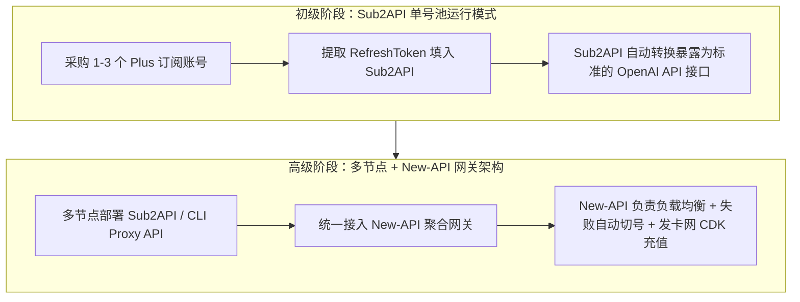

# 大模型 API 中转站商业变现与真实项目部署指南 (/sk-api-relay)

> [!IMPORTANT]
> **拒绝模糊概念与幻觉误导**：本指南只针对 GitHub 上**物理真实存在**的开源大模型中转与代理项目（如 `sub2api`、`calciumion/new-api`、`songquanpeng/one-api`）进行精准拆解与部署说明，绝不推荐无关的第三方插件。

---

## 🧭 物理真实开源项目选型与底层运作机制

### 1. 真实开源项目一览

| 开源项目名称 | GitHub 物理仓库 | 核心功能与运作原理拆解 |
| :--- | :--- | :--- |
| **Sub2API** | `sub2api/sub2api` | **订阅号池转 API 平台**：专门用于将多个 ChatGPT Plus / Claude 官方订阅账号通过 SessionToken / RefreshToken 转化为标准的 OpenAI 格式 API 端口。 |
| **New-API** | `calciumion/new-api` | **企业级大模型聚合网关**：基于 One-API 深度优化的二开系统。负责多节点聚合、多渠道负载均衡、失败无感自动重试、CDK 兑换码生成与模型分组倍率扣费。 |
| **One-API** | `songquanpeng/one-api` | **经典大模型分发系统**：最早的开源 LLM API 管理统一接入与二次分发平台。 |
| **CLI Proxy API** | `cli-proxy-api` / `router-protocol` | **命令行代理转接 API**：将基于 OAuth/网页认证的 CLI 终端工具（如 Claude Code / Codex）封装暴露为标准 OpenAI/Claude API 接口。 |

> [!CAUTION]
> **避坑澄清**：市面上的 `Shop2API` 实际为 WordPress/WooCommerce 的电商同步插件，并非 AI API 中转系统，切勿混淆！

---

## 二、 架构演进与具体运作流程



### 1. Sub2API 底层运作机制
1. **账号凭证提取**：站长通过浏览器控制台或脚本获取 Plus 账号的 `AccessToken` / `RefreshToken`。
2. **号池自动轮询**：`Sub2API` 后台维护号池，收到 API 请求时自动选择可用账号转发至 OpenAI Web 后端。
3. **协议映射与计费**：将 Web 端的流式输出（SSE）解析映射为标准 `/v1/chat/completions` JSON 格式响应给客户端，并精确统计 Token 消耗。

---

## 三、 服务器购置与 AI 辅助自动化部署

### 1. 海外 VPS 服务器购置指南

- **为什么必须选海外服务器**：国内云服务器（阿里云/腾讯云）由于网络封锁无法直连 OpenAI/Claude 接口，且必须要 ICP 备案。
- **推荐提供商**：**RackNerd、Cloudcone、Vultr、DigitalOcean、雨云海外 VPS**。
- **配置推荐**：新手阶段购买**轻量型云主机（1核 1GB/2GB 内存，月费约 $1.5~$3 刀，年费约 $10~$20 刀）**即可稳定支撑每天数万次请求。

---

### 2. 利用 AI 驱动服务器自动化部署

小白站长无需熟记 Linux 命令，可使用具备 SSH 执行能力的 AI Agent（如 Claude Code, Antigravity 或终端 AI 插件）直接向 AI 下达部署指令：

#### 提示词模板 (Prompt)：
> *"我刚购置了一台 Ubuntu 22.04 海外 VPS（IP: xxx.xxx.xxx.xxx），请帮我自动执行以下动作：1. 安装 Docker 与 Docker-Compose；2. 部署 sub2api/sub2api 容器；3. 配置 Caddy 反向代理并申请 api.mydomain.com 的 SSL 证书。"*

#### 自动化部署脚本与配置文件：

```bash
# 1. 自动安装 Docker
curl -fsSL https://get.docker.com | sh
systemctl enable --now docker

# 2. 创建 Sub2API 目录与 Docker-Compose 配置
mkdir -p /opt/sub2api && cd /opt/sub2api

cat << 'EOF' > docker-compose.yml
version: '3.9'
services:
  sub2api:
    image: sub2api/sub2api:latest
    container_name: sub2api
    restart: always
    ports:
      - "8080:8080"
    environment:
      - TZ=Asia/Shanghai
    volumes:
      - ./data:/app/data
EOF

# 3. 启动 Sub2API
docker compose up -d
```

---

## 四、 收单发卡与成本评估定价模型

### 1. 收单流程（联动小铺 / 发卡网卖 CDK）
新手无需对接复杂的海外信用卡网关：
1. 站长在 `New-API` 或 `Sub2API` 后台批量生成指定面额的 **CDK 兑换码**（如 5元、10元、50元、100元）。
2. 将 CDK 上架至**联动小铺发卡网**，客户付款后系统自动发放卡密。
3. 客户在 API 中转站点击“充值 (Top-up)”，输入卡密即可增加可用余额并生成 API Key。

---

### 2. 服务器运维成本评估与科学定价公式

在定价前，站长必须先精确算准**月度全套运维成本**：

$$\text{月度总运维成本 (Cost)} = \text{VPS服务器月费} + \text{域名摊销} + \text{Plus账号采购成本} + \text{住宅 IP 代理费}$$

- **保本单价计算**：
  假设每月 VPS + 域名 + 2个 Plus 账号 + 住宅代理总成本为 **350 元人民币**，预计提供 **$200 美元总额度**：
  $$\text{保本单价} = \frac{350 \text{ 元}}{200 \text{ 美元}} = 1.75 \text{ 元 / \$ 额度}$$

- **两大定价变现路线**：
  1. **低价 10% 薄利跑大流水模式（推荐）**：将售价定为 **2.0 元 / $ 额度**（微幅加价 10%~15%），靠 Skill 教程自媒体引流和低价优势做大用户量与每日 Token 消耗流水，获得稳健的被动收入。
  2. **高毛利模式**：将售价定为 **2.8 ~ 3.5 元 / $ 额度**，提供一对一远程安装指导与技术支持。

---

## 💻 技能 CLI 命令行快速测试

```bash
cd c:\Users\gool\Desktop\skilldb\skills\sk-api-relay-monetization\scripts
python cli.py --help
```
