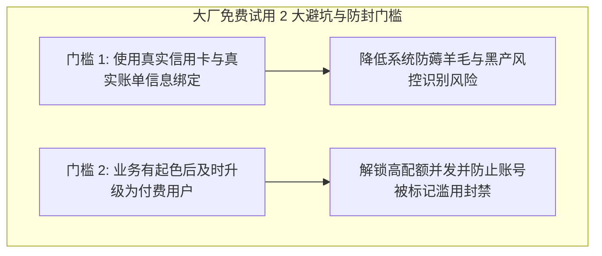

# 大模型 API 中转站商业变现与真实项目部署指南 (/sk-api-relay)

> [!IMPORTANT]
> **项目选择建议**：API 中转站首推 `sub2api/sub2api`。本指南只针对 GitHub 上**物理真实存在**的开源大模型中转与代理项目（`sub2api/sub2api`、`router-for-me/CLIProxyAPI`）进行精准拆解与部署说明。

---

## 🧭 物理真实开源项目选型与底层运作机制

### 1. 真实开源项目一览

| 开源项目名称 | GitHub 物理仓库 | 核心功能与运作原理拆解 |
| :--- | :--- | :--- |
| **Sub2API（首推）** | `sub2api/sub2api` | **订阅号池转 API 平台**：专门用于将多个 ChatGPT Plus / Claude 官方订阅账号通过 SessionToken / RefreshToken 转化为标准的 OpenAI 格式 API 端口。 |
| **CLIProxyAPI** | `router-for-me/CLIProxyAPI` | **命令行代理转接 API**：将基于 OAuth/网页认证的 CLI 终端工具（如 Claude Code / Codex）封装为兼容 OpenAI、Gemini、Claude、Codex 等接口的 API 服务。 |

---

## 二、 服务器购置：传统 VPS vs 大厂免费试用冷启动策略

在配置服务器时，站长需根据资金预算与阶段灵活选择部署环境：

### 1. 传统 VPS (RackNerd / Cloudcone / Vultr)
- **优势**：**预付费固定账单**（$10~$20/年），流量用完即停，零天价扣费风险，控制台极简。适合求稳、避开资金风险的站长。

---

### 2. 公有云大厂免费试用策略 (AWS / GCP / Azure 0成本冷启动)

如果希望在业务起步阶段实现**零服务器成本冷启动**，充分利用 Google Cloud (GCP $300体验金)、AWS (12个月免费额度) 及 Azure ($200赠金) 是极佳的途径：



> [!CAUTION]
> **使用大厂免费额度的 2 大核心防封与避坑门槛**：
> 
> 1. **真实信用卡与真实信息绑定**：
>    注册 GCP/AWS/Azure 时，必须使用真实的个人外币信用卡（Visa/MasterCard）及真实的账单地址信息，切勿使用假身份或批量生成的虚假卡号，才能顺畅通过欺诈风控。
> 2. **业务有起色后及时升级为付费用户 (Pay-as-you-go)**：
>    当业务跑起来、产生了实际客户与充值收入后，**第一时间将免费体验账号主动升级为正规绑卡付费用户**。主动升级不仅能解锁更大的 QPS 并发与服务器配额，更能彻底避开大厂风控系统将账号判定为恶劣“滥用 (Abuse/Fraud)”而导致封号或停机！

---

## 三、 利用 AI 驱动服务器自动化部署

小白站长无需熟记 Linux 命令，可使用具备 SSH 执行能力的 AI Agent（如 Claude Code, Antigravity 或终端 AI 插件）直接向 AI 下达部署指令：

#### 提示词模板 (Prompt)：
> *"我刚购置了一台 Ubuntu 22.04 海外 VPS（IP: xxx.xxx.xxx.xxx），请帮我自动执行以下动作：1. 安装 Docker 与 Docker-Compose；2. 部署 sub2api/sub2api 容器；3. 配置 Caddy 反向代理并申请 api.mydomain.com 的 SSL 证书。"*

#### 自动化部署脚本命令：

```bash
# 1. 自动安装 Docker
curl -fsSL https://get.docker.com | sh
systemctl enable --now docker

# 2. 创建 Sub2API 目录与 Docker-Compose 配置
mkdir -p /opt/sub2api && cd /opt/sub2api

cat << 'EOF' > docker-compose.yml
version: '3.9'
services:
  sub2api:
    image: sub2api/sub2api:latest
    container_name: sub2api
    restart: always
    ports:
      - "8080:8080"
    environment:
      - TZ=Asia/Shanghai
    volumes:
      - ./data:/app/data
EOF

# 3. 启动 Sub2API
docker compose up -d
```

---

## 四、 收单发卡与成本评估定价模型

### 1. 收单流程（联动小铺 / 发卡网卖 CDK）
1. 站长在 `Sub2API` 后台批量生成指定面额的 **CDK 兑换码**（如 5元、10元、50元）。
2. 将 CDK 上架至**联动小铺发卡网**，客户付款后系统自动发放卡密。
3. 客户在 API 中转站点击“充值 (Top-up)”，输入卡密即可瞬间兑换为额度生成 API Key。

---

### 2. 成本评估与定价公式

$$\text{月度总运维成本 (Cost)} = \text{VPS服务器月费} + \text{域名摊销} + \text{Plus账号采购成本} + \text{住宅 IP 代理费}$$

- **两大定价变现路线**：
  1. **低价 10% 薄利跑大流水模式（推荐）**：将售价定为 **2.0 元 / $ 额度**（微幅加价 10%~15%），靠 Skill 教程自媒体引流和低价优势做大用户量与每日 Token 消耗流水，获得稳健的被动收入。
  2. **高毛利模式**：将售价定为 **2.8 ~ 3.5 元 / $ 额度**，提供一对一远程安装指导与技术支持。

---

## 💻 技能 CLI 命令行快速测试

```bash
cd c:\Users\gool\Desktop\skilldb\skills\sk-api-relay\scripts
python cli.py --help
```
