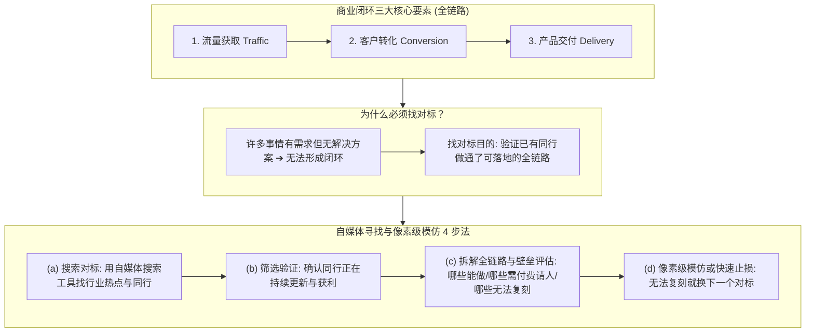

# AI 变现底层商业闭环判定框架 (/sk-business)

> [!IMPORTANT]
> **商业的本质**：AI 变现是一门严肃的商业行为。一个能够真正落地赚钱的项目，**必须具备【流量 ➔ 转化 ➔ 交付】的全链路解决方案**。缺少任何一个环节，都无法构成合格的商业闭环。

本 Skill 为 SkillDB 系统底层商业判定引擎，用于**评估项目能否赚钱、诊断商业卡点、以及通过自媒体寻找并像素级复刻成功项目**。

---

## 🧭 商业闭环判定模型与自媒体 4 步寻找法



---

## 一、 为什么必须寻找对标？(解决方案验证)

许多创业者常犯的误区是：看到某件事有很大用户需求，就盲目投入开发。

> **关键认知**：**有用户需求 ≠ 能形成商业闭环！**
> 现实中有大量痛点虽然存在，但**受限于技术、成本或政策，根本没有可落地的全链路解决方案**。

寻找对标的根本目的，是去寻找并验证：**“市场上是否已经有同行把【流量 ➔ 转化 ➔ 交付】的全流程真正做通了？”** 只要对标存在并正在持续获利，就证明该闭环解决方案 100% 成立。

---

## 二、 模仿对标时的壁垒评估与止损法则

在像素级复刻对标时，难点在于**客观评估自身的的能力与边界**：

### 1. 拆解能力壁垒 (做不到的环节怎么处理？)
当你尝试复刻对标的全流程时，仔细梳理每一个环节，分为三类：
- **自行解决 (改变自己)**：属于技能提升或习惯调整范畴（如学会自媒体剪辑、学会编写简单脚本、学习说术）。
- **付费请人/合作 (付出一定代价)**：自身短期无法突破的技术或资源（如请专业人员搭建高并发后端、采购稳定住宅代理 IP、合作分润）。
- **完全无法复刻 (硬性不可逾越壁垒)**：需要极高门槛、大额资金投入或不可控资源的环节。

### 2. 极简止损法则：无法复刻就果断换下一个
如果经过评估发现某个对标的交付门槛极高，自身现阶段**实在无法复刻**：

> [!TIP]
> **果断止损，不要死磕！**
> 核心原则非常简单：**直接放弃该对标，换一个项目，继续搜索下一个可复刻的对标即可！** 寻找下一个自身能够 100% 闭环复刻的项目。

---

## 三、 实战案例推导：`AI 漫剧制作` / `AI 写小说` / `AI 卖课` 能赚钱吗？

应用本框架对目前热门的 **“AI 漫剧制作 / AI 写小说 / AI 剧本卖课变现”** 进行三维推导判定：

### 1. 数据验证 (Data Reality)
- **现象**：自媒体上有不少宣称“用 AI 写小说日入几百”、“零基础制作 AI 漫剧卖课”的爆款视频。
- **真实数据拆解**：
  - 只有极少数具有专业编剧/美术背景的头部机构能通过卖课（¥199~¥999）产生收入。
  - **95%+ 的新手小白视频播放量仅为几百，转化几乎为零**。平台算法对低质量、同质化 AI 抽卡视频（人设不连贯、缺乏情感）严重限流。

### 2. 难点分析与硬核壁垒 (Barrier Analysis)

| 壁垒维度 | 难点拆解 | 小白能否快速解决？ |
| :--- | :--- | :--- |
| **(a) 个人审美** | 画面构图、色调风格、角色一致性把控要求极高。缺乏审美会导致作品充满廉价“AI味”。 | ❌ 属于个人长期审美积淀，**短期无法速成**。 |
| **(b) 专业编剧技能** | 剧本/小说并非依靠 AI 随机吐字，需要深刻把握戏剧冲突、爽点节奏、情绪钩子。 | ❌ 需要 2~3 年专业文案/编剧功底。 |
| **(c) 导演与镜头语言** | AI 漫剧需要景深、分镜、推拉摇移、戏剧张力与音效卡点。 | ❌ 需要 1~2 年影视分镜科班知识。 |

### 3. 学习成本与最终判决 (Judgment)
- **学习周期**：传统方法或 AI 辅助下，掌握编剧 + 导演分镜 + 审美至少需要 **6~12 个月以上**。
- **最终判决**：对于想快速拿到商业结果的小白来说，**AI 漫剧/AI 写小说是一个“看似需求大，实则门槛极高、交付极其困难、极难形成闭环”的项目**。
- **行动决策**：**根据止损法则，果断放弃！直接换下一个门槛低、无审美编剧要求、能快速闭环的项目（如 API 中转站/小白软件配置/接码服务）！**

---

## 四、 自媒体寻找与复刻对标 4 步实操

### 1. 搜索对标 (利用工具锁定同行)
- **搜索平台**：小红书、B站、公众号、抖音、知乎。
- **关键词检索**：搜索 `AI 工具`、`AI 变现`、`AI 效率`、`ChatGPT 教程`、`Codex 实操`、`API 中转`。

### 2. 筛选验证 (确认对标正在持续盈利)
- 观察该账号是否在过去 1~3 个月内**持续高频更新**（持续更新意味着正反馈与商业收益）。
- 观察评论区是否有大量“怎么用”、“求链接”、“怎么收费”的精准意向购买留言。

### 3. 拆解全链路与评估壁垒
深入拆解流量、转化说术与交付形态，评估自身能否复刻：
- 如果能力可覆盖或可通过小代价请人解决 ➔ 进入步骤 4 复刻。
- 如果门槛过高（如 AI 漫剧涉及审美与编剧壁垒） ➔ **果断放弃，回到步骤 1 搜索下一个对标**。

### 4. 像素级模仿与复刻 (Pixel-Level Copying)
- **100% 模仿成功路径**：采用同样的自媒体引流形式、同样的转化说术结构与同样的交付形态，避开盲目摸索成本，快速拿到商业结果！

---

## 💻 技能 CLI 命令行快速测试

```bash
cd c:\Users\gool\Desktop\skilldb\skills\sk-monetization-framework\scripts
python cli.py --help
```
