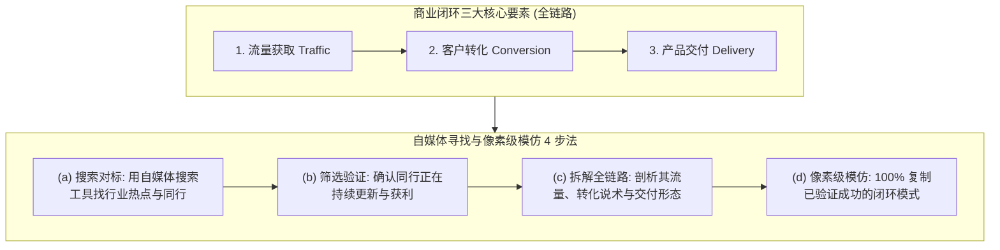

# AI 变现底层商业闭环判定框架 (/sk-business)

> [!IMPORTANT]
> **商业的本质**：AI 变现是一门严肃的商业行为。一个能够真正落地赚钱的项目，**必须具备【流量 ➔ 转化 ➔ 交付】的全链路解决方案**。缺少任何一个环节，都无法构成合格的商业闭环。

本 Skill 为 SkillDB 系统底层商业判定引擎，用于**评估项目能否赚钱、诊断商业卡点、以及通过自媒体寻找并像素级复刻成功项目**。

---

## 🧭 商业闭环判定模型与自媒体 4 步寻找法



---

## 一、 什么项目能赚钱？(商业闭环判定标准)

判断一个 AI 项目或副业能否赚钱，只需用 **【流量 ➔ 转化 ➔ 交付】三要素模型** 进行扫描判定：

| 评估维度 | 核心定义与判定标准 | 常见失败误区（无法赚钱） |
| :--- | :--- | :--- |
| **1. 流量 (Traffic)** | 如何持续获取有痛点的精准目标客户？ | 只有技术或产品，无人知晓，没有获取客户的渠道。 |
| **2. 转化 (Conversion)** | 如何说服客户下单，完成信任与资金交换？ | 有粉丝或播放量，但没有清晰的说术、价格锚点或收单工具。 |
| **3. 交付 (Delivery)** | 如何高效提供产品或服务，并保证稳定与复购？ | 只有想法或虚幻宣传，无法交付稳定可用的实物/服务/接口。 |

> **判决定理**：**只有当【流量 ➔ 转化 ➔ 交付】三者同时成立并顺畅串联时，商业闭环才算完成，项目才能真正赚钱。**

---

## 二、 寻找与复刻赚钱项目的自媒体 4 步法

商业变现最快、成功率最高的捷径并非凭空想象，而是**在自媒体平台寻找已经验证赚钱的同行，进行像素级拆解与模仿**。

### 1. 搜索对标 (利用工具锁定同行)
- **搜索平台**：小红书、B站、公众号、抖音、知乎。
- **关键词检索**：搜索 `AI 工具`、`AI 变现`、`AI 效率`、`ChatGPT 教程`、`Codex 实操`、`API 中转`。
- **目标**：找到同领域内正在发帖、互动量较高且有明确引流动作的对标账号。

### 2. 筛选验证 (确认对标正在持续盈利)
- 观察该账号是否在过去 1~3 个月内**持续高频更新**（持续更新意味着正反馈与商业收益）。
- 观察评论区是否有大量“怎么用”、“求链接”、“怎么收费”的精准意向购买留言。

### 3. 拆解全链路 (剖析其流量、转化与交付细节)
深入拆解该对标账号的全流程：
- **流量层**：它的标题、封面、开头前 3 秒钩子是什么？它是靠教程、避坑还是工具分享引流？
- **转化层**：它是引导私信、群聊、还是个人微信？它的说术是什么？它使用了什么充值网关或发卡网？
- **交付层**：它最终给客户交付的是卡密、账号、中转 API 接口、还是远程安装服务？

### 4. 像素级模仿与复刻 (Pixel-Level Copying)
- **100% 模仿成功路径**：不要随意修改经过市场验证的路径。直接采用同样的自媒体引流形式、同样的转化说术结构与同样的交付形态。
- **快速拿到商业结果**：通过像素级模仿，避开从 0 到 1 盲目摸索的避坑成本，迅速拿到正向现金流！

---

## 💻 技能 CLI 命令行快速测试

```bash
cd c:\Users\gool\Desktop\skilldb\skills\sk-monetization-framework\scripts
python cli.py --help
```
