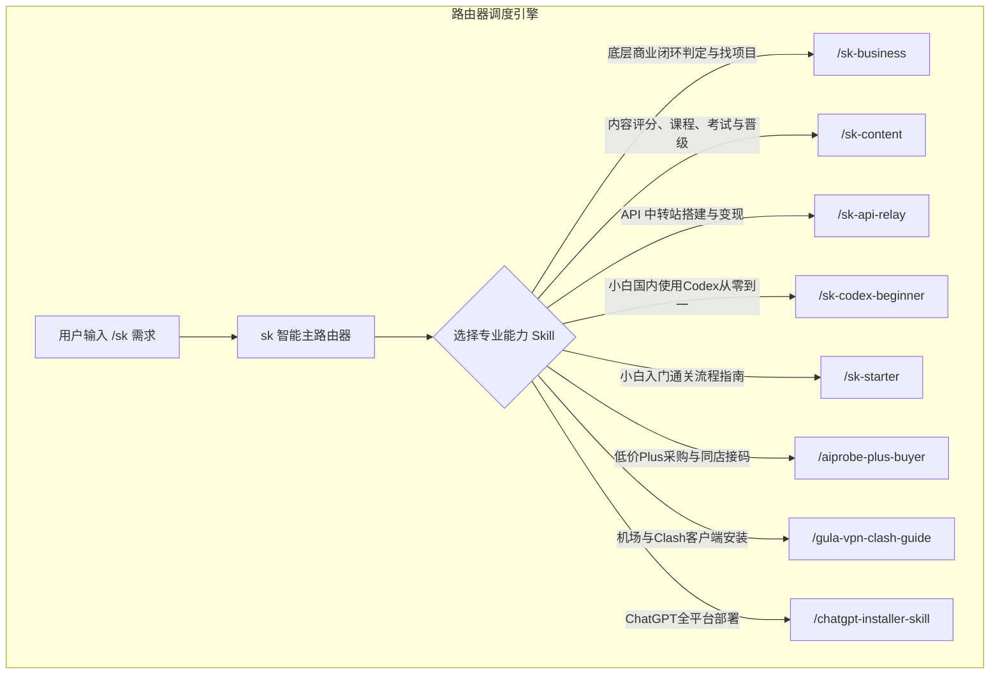

# 主分发路由器 Skill (/sk)

`sk` 是 Skill System 的总指挥与调度路由器。用户无需记忆具体的 Skill 名称，只需在命令前加 `/sk`，系统会自动调度最契合的通关 Skill。

---

## 🧭 路由逻辑架构



---

## 核心功能规范

1. **显式命令优先**：用户直接输入具体 Skill 名称时，立即进入对应 Skill。
2. **按核心任务分发**：根据用户现在要完成的任务选路由，不因为对话中出现“赚钱”就一律进入商业诊断。
3. **只调用必要能力**：路由完成后读取目标 Skill 并执行，不在主路由器内重新编造简化版答案。
4. **组合任务分阶段**：同时包含商业判断和内容获客时，先完成商业闭环判断，再进入内容训练或作品评审。
5. **保留学习状态**：内容课程再次进入 `/sk-content` 时，沿用用户当前年级、作品证据和补强任务。

## 路由判定表

| 用户意图或关键词 | 路由 | 判定说明 |
|---|---|---|
| 短视频、内容创作、不会拍、不会写、想系统学习 | `/sk-content` | 进入 K1–K12 定级或当前年级教学 |
| 内容评分、视频诊断、文案、画面、声音、人物状态 | `/sk-content` | 进入文本预评或多模态作品评审 |
| K1–K12、课程、考试、晋级、补考、跳级、认证 | `/sk-content` | 进入对应年级教案与 AI 动态考试 |
| 内容获客、信任、同频、成交、个人 IP、影响力 | `/sk-content` | 进入 K7–K12 能力训练或定级 |
| 做什么项目、能否赚钱、商业闭环、商业对标 | `/sk-business` | 判断流量、转化和交付是否成立 |
| Sub2API、CLIProxyAPI、API 中转站 | `/sk-api-relay` | 进入中转站部署与经营 |
| Codex 小白使用、网络、账号、客户端安装 | 对应现有安装类 Skill | 根据对象继续细分 |

## `/sk-content` 转接规则

转接后先识别用户属于哪种状态：

- **没有作品、第一次学习**：从 K1 开始；
- **有作品但不知道等级**：先进行暂定定级，再补充作品或动态问答；
- **正在学习某一级**：继续当前年级，不重新从 K1 开始；
- **提交文稿**：明确标注“文本预评”，不猜测画面和声音；
- **提交完整视频**：进行文案、画面、音频、镜头表现和音画协同评审；
- **申请考试或晋级**：核验训练证据，再进入 AI 动态考试；
- **已有成熟经验**：允许申请跳级，但必须通过陌生材料和现场应用。

---

## 使用示例

```bash
# 评估商业闭环与找对标
/sk 怎么判断一个 AI 项目能不能赚钱？怎么在自媒体上找对标？

# 系统转接至 /sk-business 并输出商业闭环判定模型与自媒体 4 步模仿法

# 评估一篇内容并制定晋级课程
/sk 给这篇内容评分，判断我处于 K1-K12 的哪一级

# 系统转接至 /sk-content 并输出评分、等级与下一步训练

# 从零开始学习
/sk 我完全不会做短视频，带我从第一阶段开始

# 多模态作品评审
/sk 分析这条视频的文案、画面、声音、人物状态和信任感

# 内容获客与 IP
/sk 我想通过短视频建立个人 IP、获得信任并成交

# 以上请求全部转接至 /sk-content
```
